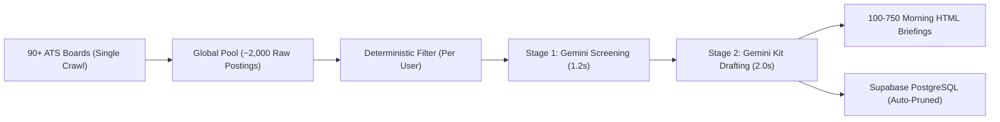
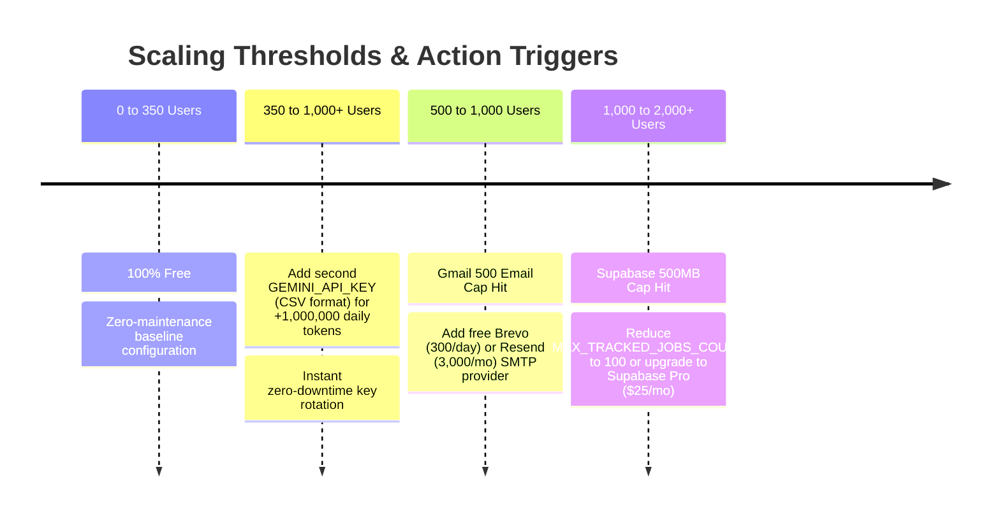

# 📊 Job Hunter — Operational Architecture & Business Metrics

This document outlines the operational capacity, resource consumption, infrastructure scaling thresholds, and cost economics of the **Job Hunter** autonomous career intelligence platform.

---

## 1. Executive Summary

Job Hunter is engineered with a **Centralized Multi-Tenant Global Pool** architecture. Instead of crawling job boards separately for every user, the crawler executes a **single-pass crawl** across all 90+ ATS endpoints every morning, deduplicates jobs into an in-memory pool, and evaluates all candidates concurrently.

Combined with **self-compacting storage pruning** and **frontier AI splitting**, the system operates at **$0.00 / month** for up to **~350 daily active users**.

---

## 2. Multi-User Scale & Workload Matrix

| Metric | 100 Users | 250 Users | 500 Users | 750 Users | 1,500 Users |
|---|:---:|:---:|:---:|:---:|:---:|
| **Daily Discovered Jobs** | ~2,000 | ~2,000 | ~2,000 | ~2,000 | ~2,000 |
| **ATS Crawl Requests** | ~95 | ~95 | ~95 | ~95 | ~95 |
| **Stage 1 Screening Calls (Gemini)** | ~300 | ~750 | ~1,500 | ~2,250 | ~4,500 |
| **Stage 2 Kit Drafting Calls (Gemini)** | ~300 | ~750 | ~1,500 | ~2,250 | ~4,500 |
| **Emails Dispatched / Day** | 100 | 250 | 500 | 750 | 1,500 |
| **Daily Cron Runtime (GitHub Actions)** | ~2.5 mins | ~4.5 mins | ~8.5 mins | ~14 mins | ~25 mins |
| **Permanent DB Size Plateau** | ~25 MB | ~62.5 MB | ~125 MB | ~187.5 MB | ~375 MB |
| **Total Monthly Running Cost** | **$0.00** | **$0.00** | **$0.00** | **$0.00** | **~$10 – $15** |
| **Free Tier Status** | 🟢 100% Free (1 Key) | 🟢 100% Free (1 Key) | 🟢 100% Free (2 CSV Keys) | 🟢 100% Free (3 CSV Keys) | 🔴 Paid Expansion |

---

## 3. Component-by-Component Infrastructure Breakdown

### A. Primary AI Engine: Google Gemini Flash (`gemini-3.6-flash`)
* **Default Model**: `gemini-3.6-flash`
* **Batch Size**: 8 jobs per screening request (high-throughput evaluation pass).
* **Batch Pacing**: 4.0s delay between requests = 15 RPM exact speed matching.
* **Multi-Key CSV Rotation**: Instant zero-downtime rotation across comma-separated keys (`GEMINI_API_KEY=key1,key2,key3`).
* **Daily Free Quota**: **1,500 requests / day** and **1,000,000+ tokens / day** per project key.
* **Per-User Daily Consumption**: ~6 API calls (3 screening batches + 3 kit drafts).
* **Capacity**:
  * **1 Gemini API Key**: 250 Daily Active Users (**100% Free Forever**)
  * **2 Gemini API Keys**: 500 Daily Active Users (**100% Free Forever**)
  * **3 Gemini API Keys**: 750 Daily Active Users (**100% Free Forever**)

### C. Database & Multi-Tenant Storage (Supabase PostgreSQL)
* **Free Tier Quota**: **500 MB Database Storage** & **50,000 Monthly Active Users**.
* **Storage Invariant**: Every user profile is capped at a rolling retention window of **300 unapplied jobs** (`jobhunt/store.py:prune_old_jobs`).
* **Protected Records**: Jobs marked `Applied`, `Interviewing`, or `Offer` are **never pruned**.
* **Storage Plateau**:
  * Average size per stored job kit: **~1.5 KB**
  * 300 jobs $\times$ 1.5 KB = **~450 KB per user**
  * 300 Users = **~135 MB total** (Uses **27%** of 500 MB free tier).

### D. Daily Briefing Dispatch (Gmail SMTP)
* **Free Outbound Limit**: **500 emails / 24 hours** per Google Account.
* **Capacity**:
  * 100 Users: 100 emails (**20%** of limit)
  * 300 Users: 300 emails (**60%** of limit)
  * *Threshold*: Hard ceiling reached at **500 users**.

### E. Compute & Automation (GitHub Actions Cloud)
* **Free Monthly Minutes**: **2,000 minutes / month** (or unlimited if repository is public).
* **Schedule**: Daily at **09:00 AM IST** (`30 3 * * *`).
* **Capacity**:
  * 100 Users: 7 min/day $\times$ 30 = **210 mins/mo** (**10.5%** of quota)
  * 300 Users: 17 min/day $\times$ 30 = **510 mins/mo** (**25.5%** of quota)

---

## 4. The Steady-State Storage Equilibrium Model

Traditional databases grow indefinitely over time ($O(N \times T)$), eventually causing disk crashes. Job Hunter uses an **$O(N)$ bounded sliding window**:

$$\text{Database Storage}(t) = N_{\text{users}} \times \left( M_{\text{active\_jobs}} \times S_{\text{job\_record}} + M_{\text{applied\_jobs}} \times S_{\text{job\_record}} + S_{\text{profile}} \right)$$

Where:
* $M_{\text{active\_jobs}} \le 300$ (enforced by FIFO pruning)
* $S_{\text{job\_record}} \approx 1.5 \text{ KB}$
* $S_{\text{profile}} \approx 2.0 \text{ KB}$

**Result**: After ~45 days of initial scan accumulation, storage stops growing and reaches a permanent, stable equilibrium plateau.

---

## 5. Scaling Thresholds & Friction Milestones

---

## 6. Real-World Risk & Mitigation Playbook

| Risk Factor | Impact | Mitigation Strategy |
|---|---|---|
| **AI Provider Free Tier Changes / Rate Limits (TPM/429)** | Provider reduces limits or hits 429 quota spikes | Sequential 3.5s batch delay + 62s reset window on 429 + instant auto-switch between Groq, Gemini, Anthropic, and local Ollama via environment variables. |
| **ATS Anti-Scraping Policies** | ATS adds bot challenge on public endpoints | All 9 supported ATS engines use standard public JSON career APIs that have remained open for over a decade. Proxy rotation can be enabled if needed. |
| **Email Deliverability (Spam Filter)** | High-volume emails from `@gmail.com` land in spam | For >300 users, connect a custom domain with verified SPF, DKIM, and DMARC DNS records via Amazon SES or Resend. |
| **GitHub Access Token Expiration** | Workflow dispatch fails to trigger | Set GitHub Personal Access Tokens (`GH_TOKEN`) with "No Expiration" or rotate annually. |

---

## 7. Cost Comparison: Job Hunter vs. Commercial SaaS Alternatives

| Capability | Job Hunter (Self-Hosted) | Commercial Job Tracker SaaS |
|---|:---:|:---:|
| **300 Daily Candidate Briefings** | **$0.00 / mo** | ~$150 – $300 / mo |
| **Real Frontier AI Tailoring (Gemini/Groq)** | **$0.00 / mo** | Included in Pro (~$29/user/mo) |
| **90+ ATS Boards Indexing** | **$0.00 / mo** | Limited to major platforms |
| **Multi-Tenant User Isolation** | **Included (Supabase RLS)** | Enterprise Tier Only |
| **Annual Running Cost (300 Users)** | **🎉 $0.00 / Year** | **~$1,800 – $3,600 / Year** |
