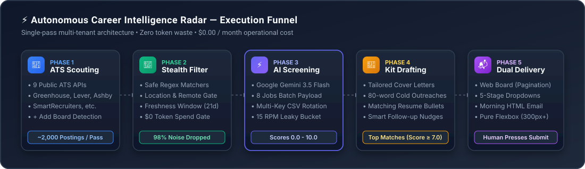
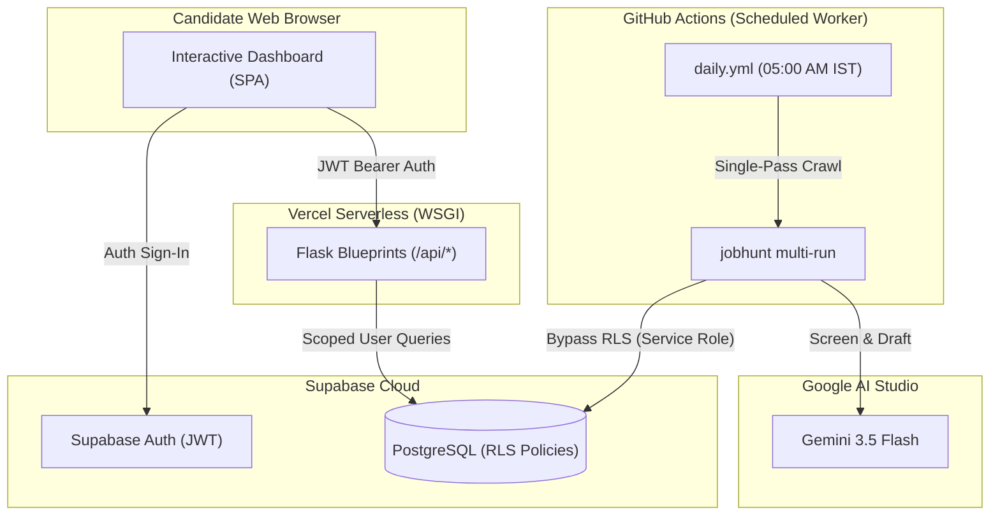

<p align="center">
  <a href="https://job-hunter-web-board.vercel.app">
    
  </a>
</p>

<h1 align="center">Job Hunter</h1>

<p align="center">
  <strong>Autonomous AI Career Intelligence Engine &amp; Real-Time Job Discovery Platform</strong>
</p>

<p align="center">
  <a href="https://job-hunter-web-board.vercel.app"></a>
  <a href="https://github.com/tanish-jain-225/job-hunter/actions/workflows/ci.yml"></a>
  <a href="tests/"></a>
  <a href="tests/"></a>
  <a href="https://python.org"></a>
  <a href="LICENSE"></a>
  <a href="https://github.com/astral-sh/ruff"></a>
  <a href="https://mypy-lang.org"></a>
</p>

<p align="center">
  <a href="https://job-hunter-web-board.vercel.app"><strong>Explore Web Board &raquo;</strong></a> &bull;
  <a href="docs/GUIDE.md">User Guide</a> &bull;
  <a href="docs/SETUP.md">Setup Guide</a> &bull;
  <a href="docs/ARCHITECTURE.md">System Architecture</a> &bull;
  <a href="docs/API.md">REST API</a> &bull;
  <a href="docs/DEPLOYMENT.md">Cloud Deployment</a> &bull;
  <a href="docs/METRICS.md">Scaling &amp; Metrics</a>
</p>

---

<p align="center">
  
</p>

---

## The Narrative: Why Job Hunter?

The modern job search is fundamentally broken. Engineers and technology professionals spend dozens of hours every week manually checking disjointed career pages, sifting through sponsored spam on aggregator platforms, fighting keyword stuffing, and writing repetitive cover letters into ATS black holes.

**Job Hunter (`job-hunter`)** flips the model completely. It is your private, autonomous career intelligence agent that runs continuously:

1. **Scouts Public ATS Endpoints Directly**: Discovers open positions directly from public, unauthenticated career board APIs across 88+ curated tech companies and 9 major ATS platforms (**Greenhouse**, **Lever**, **Ashby**, **Workable**, **SmartRecruiters**, **BambooHR**, **Recruitee**, **Breezy HR**, and **Pinpoint**) with zero brittle web scraping and zero authentication barriers.
2. **Eliminates Noise at $0 Cost**: Drops ~98% of out-of-scope, senior executive, or stale postings deterministically using fast regex title, location, and freshness rules **before spending a single AI token**.
3. **Evaluates Fit via Google Gemini 3.5 Flash**: Batches surviving jobs (8 jobs/request) to compute structured candidate fit scores (0.0 to 10.0) against your parsed resume context using **Google Gemini (`gemini-3.5-flash`)**, featuring 1M free daily tokens per project, circular multi-key rotation, 15 RPM leaky-bucket pacing, and automated dynamic fallback cascades (`gemini-flash-latest` &rarr; `gemini-flash-lite-latest`).
4. **Drafts Tailored Application Kits**: Produces tailored cover notes, 80-word LinkedIn networking outreach messages, matching resume alignment bullets, and interview prep questions for top-scoring roles (7.0+).
5. **Organizes Everything on an Executive Web Board**: Interactive single-page web dashboard with 5-stage pipeline tracking (*To Apply*, *Applied*, *Interviewing*, *Offer*, *Rejected*), live search, ATS board filtering, notes, and 4-day follow-up nudge alerts.
6. **Delivers an Executive Morning Briefing**: Dispatches a clean, responsive HTML email digest to your inbox every morning with direct 1-click application links.
7. **Runs 100% Free Forever**: Operates within free-tier allowances across Vercel (Hobby), Supabase (Free tier 500 MB PostgreSQL + Auth), Google Gemini (1M free tokens/day via AI Studio), and GitHub Actions—supporting **300 Daily Active Users out-of-the-box** (and up to **500–1,040 users** with multi-key CSV rotation) at **$0.00/month** total operating cost.

> [!IMPORTANT]
> **The Golden Rule of Job Hunter**: *The Hunter never fires without manual authorization.* **Job Hunter** never automatically submits applications. It scouts, filters, scores, and drafts—leaving final application review and submission strictly under human control.

### Commercial Alternatives vs. Job Hunter

| Dimension | Commercial SaaS (Teal, Huntr, Jobscan) | Job Hunter (Autonomous Agent) |
|---|---|---|
| **Monthly Cost** | **$30 – $50 / month** ($360 – $600 / year) | **$0.00 / month forever** (100% Free Stack) |
| **Sourcing Method** | Manual Chrome bookmarking or spammy scrapers | **Direct Public ATS APIs** (88+ curated boards, 9 engines) |
| **AI Intelligence** | Generic GPT-4o-mini wrappers | **Google Gemini 3.5 Flash** (1M token context, multi-key rotation) |
| **Automation** | Manual tracking logins | **Automated Daily Morning Digest** (05:00 AM in your inbox) |
| **Application Policy** | Risky auto-apply bots or manual entry | **The Golden Rule**: Scout & Draft; Human Submits |
| **Data Privacy** | Closed cloud databases | **100% Private**: Supabase PostgreSQL with Row-Level Security |

---

## Table of Contents

- [The Narrative: Why Job Hunter?](#the-narrative-why-job-hunter)
- [Commercial Alternatives vs. Job Hunter](#commercial-alternatives-vs-job-hunter)
- [Key Capabilities](#key-capabilities)
- [System Architecture](#system-architecture)
- [Quickstart (30-Second Offline Smoke Test)](#quickstart-30-second-offline-smoke-test)
- [Installation &amp; Packaging](#installation--packaging)
- [Step-by-Step Setup Guide](#step-by-step-setup-guide)
  - [1. Target Companies (`companies.yaml`)](#1-target-companies-companiesyaml)
  - [2. Deterministic Filters (`config.yaml`)](#2-deterministic-filters-configyaml)
  - [3. Candidate Profile (`jobhunt profile`)](#3-candidate-profile-jobhunt-profile)
  - [4. Environment Variables (`.env`)](#4-environment-variables-env)
- [AI Engine: Google Gemini 3.5 Flash (Default &amp; Recommended)](#ai-engine-google-gemini-35-flash-default--recommended)
- [Interactive Web Dashboard &amp; UI](#interactive-web-dashboard--ui)
- [Complete CLI Command Reference](#complete-cli-command-reference)
- [Cloud Production Deployment (Vercel + Supabase)](#cloud-production-deployment-vercel--supabase)
- [Automated Scheduled Execution (GitHub Actions)](#automated-scheduled-execution-github-actions)
- [Architecture &amp; Codebase Layout](#architecture--codebase-layout)
- [ATS Quirks &amp; Edge Case Handling](#ats-quirks--edge-case-handling)
- [Security, Privacy &amp; Compliance](#security-privacy--compliance)
- [Automated Test Suite &amp; Quality Verification](#automated-test-suite--quality-verification)
- [Documentation Index](#documentation-index)
- [Contributing &amp; License](#contributing--license)

---

## Key Capabilities

| Pillar | Feature | Technical Specification |
|---|---|---|
| **Sourcing** | **9 ATS Engines** | Native JSON parsers for Greenhouse, Lever, Ashby, Workable, SmartRecruiters, BambooHR, Recruitee, Breezy HR, and Pinpoint. |
| **Ingestion** | **+ Add Board** | URL auto-detection identifies ATS engine and company slug from any public careers link with instant HTTP reachability verification. |
| **Prefilter** | **$0 Regex Gate** | Sub-millisecond deterministic regex filtering for titles, locations, job types, and 21-day listing freshness prior to LLM calls. |
| **AI Intelligence** | **Gemini 3.5 Flash** | Default intelligence engine (`gemini-3.5-flash`) with 1M tokens/day free per key, multi-key CSV rotation, and dynamic fallback cascades. |
| **Resume Studio** | **Multimodal Parsing** | In-memory PDF, TXT, and Markdown parsing via Gemini/Claude document blocks with fallback to `pypdf` and heuristic extraction. |
| **Interactive Board** | **Responsive View** | High-density card/table list with client-side pagination (10/25/50 per page), instant keyword search, and ATS filter chips. |
| **Lifecycle** | **5 Pipeline Stages** | Manage opportunities across `to_apply`, `applied`, `interviewing`, `offer`, and `rejected` with automatic stage transition tracking. |
| **Follow-Ups** | **Outreach Generator** | Generates context-aware follow-up emails and LinkedIn networking DMs with 1-click clipboard copy and 4-day nudge badges. |
| **Multi-Tenant Cloud**| **Supabase + RLS** | PostgreSQL Row-Level Security ensures strict candidate tenant isolation; public routes remain separated from protected state. |
| **Offline Local Mode**| **Air-Gapped Operation** | Operates entirely locally with local JSON (`seen.json`), automatic CSV export (`out/tracker.csv`), and offline keyword scoring. |

---

## System Architecture

```text
[Public ATS Career Boards] (Greenhouse, Lever, Ashby, Workable, SmartRecruiters, BambooHR, Recruitee, Breezy, Pinpoint)
           │
           ▼
[1. Fetch Engine] ────────── Concurrent HTTP requests with connection pooling & retry backoff (fetch.py)
           │
           ▼
[2. Regex Prefilter] ─────── Deterministic title, location, employment type & 21-day freshness gate (prefilter.py)
           │                 └─ Drops ~98% of noise at $0 token cost
           ▼
[3. LLM Screening] ───────── Batched candidate fit evaluation (0.0 to 10.0) via Google Gemini 3.5 Flash (llm.py)
           │                 └─ Multi-key rotation, 15 RPM leaky-bucket pacing & fallback cascades
           ▼
[4. Kit Drafting] ────────── Tailored cover notes, LinkedIn DMs, matching bullets & interview prep for >= 7.0 (llm.py)
           │
           ▼
[5. Persistence] ─────────── Local JSON (seen.json) / Supabase PostgreSQL with Row-Level Security (store.py / memory.py)
           │                 └─ Automated two-way sync & out/tracker.csv export
           ▼
[6. Delivery & UI] ───────── Interactive Web Dashboard (Flask/Vercel) & Daily HTML Email Briefing (digest.py / mailer.py)
```

---

## Quickstart (30-Second Offline Smoke Test)

You can run and verify the entire **Job Hunter** pipeline locally without any external API keys using bundled ATS fixtures and the offline keyword scorer:

### Windows (PowerShell):
```powershell
# 1. Clone repository
git clone https://github.com/tanish-jain-225/job-hunter.git
cd job-hunter

# 2. Set up virtual environment
python -m venv .venv
.\.venv\Scripts\Activate.ps1

# 3. Install in editable development mode
pip install -e ".[dev]"

# 4. Run offline smoke test
jobhunt run --mock --scorer keyword

# 5. Launch web dashboard
python app.py
```

### macOS / Linux (Bash):
```bash
# 1. Clone repository
git clone https://github.com/tanish-jain-225/job-hunter.git
cd job-hunter

# 2. Set up virtual environment
python3 -m venv .venv
source .venv/bin/activate

# 3. Install in editable development mode
pip install -e ".[dev]"

# 4. Run offline smoke test
jobhunt run --mock --scorer keyword

# 5. Launch web dashboard
python app.py
```

Open `http://localhost:5000` in your browser. The mock run will populate `out/digest.html` and local store files.

---

## Installation & Packaging

**Job Hunter** strictly complies with **PEP 621** packaging standards via [`pyproject.toml`](pyproject.toml). Installing it exposes the global `jobhunt` CLI command:

```bash
# Standard installation
pip install -e .

# Full development installation (includes pytest, ruff, mypy, hypothesis, coverage)
pip install -e ".[dev]"

# With optional Anthropic Claude native document support
pip install -e ".[dev,anthropic]"
```

Verify the installation:
```bash
jobhunt --version
# Output: jobhunt 1.0.0
```

---

## Step-by-Step Setup Guide

### 1. Target Companies (`companies.yaml`)

Define target company career boards in [`companies.yaml`](companies.yaml). The `slug` corresponds to the company identifier in the public careers URL:

| Board URL | `ats` | `slug` |
|---|---|---|
| `boards.greenhouse.io/stripe` | `greenhouse` | `stripe` |
| `jobs.lever.co/meesho` | `lever` | `meesho` |
| `jobs.ashbyhq.com/openai` | `ashby` | `openai` |
| `apply.workable.com/vector` | `workable` | `vector` |
| `jobs.smartrecruiters.com/visa` | `smartrecruiters` | `visa` |
| `acme.bamboohr.com/careers` | `bamboohr` | `acme` |
| `bunq.recruitee.com` | `recruitee` | `bunq` |
| `breezy.hr/acme` | `breezy` | `acme` |
| `pinpoint.work/company` | `pinpoint` | `company` |

```yaml
companies:
  - {ats: greenhouse, slug: stripe, name: Stripe}
  - {ats: ashby, slug: openai, name: OpenAI}
  - {ats: lever, slug: meesho, name: Meesho}
  - {ats: workable, slug: vector, name: Vector}
  - {ats: smartrecruiters, slug: visa, name: Visa}
  - {ats: bamboohr, slug: acme, name: Acme}
  - {ats: recruitee, slug: bunq, name: Bunq}
  - {ats: breezy, slug: postman, name: Postman}
  - {ats: pinpoint, slug: razorpay, name: Razorpay}
```

> [!TIP]
> **Live Board Verification**: Audit all configured boards for HTTP reachability at any time:
> ```bash
> jobhunt verify --companies companies.yaml --workers 20
> ```

---

### 2. Deterministic Filters (`config.yaml`)

[`config.yaml`](config.yaml) manages the $0 regex prefilter executed **before** candidate jobs reach the LLM:

```yaml
filters:
  # Included job title patterns (case-insensitive regex)
  include_titles:
    - 'software engineer'
    - 'software development engineer'
    - 'site reliability engineer'
    - '\b(backend|platform|api|systems|ai|ml)\b.*\bengineer\b'

  # Excluded titles (automatically rejected before AI evaluation)
  exclude_titles:
    - '\b(director|vice president|head of|chief|vp)\b'
    - '\b(manager|management|lead|principal)\b'

  # Locations: empty list accepts all regions; allow_remote keeps remote roles
  locations: []
  allow_remote: true

  # Employment types (fulltime, internship, remote, hybrid, onsite)
  job_types: []
  max_age_days: 21

# Concurrency & Rate Limiting (Optimized for Gemini Flash Free Tier)
screen_batch_size: 8      # Postings batched per screening request
screen_jd_chars: 1000     # Description character limit for fit evaluation
draft_jd_chars: 6000      # Full context for tailored kit drafting
score_threshold: 7.0      # Minimum score (0.0 to 10.0) for application kit generation
max_per_digest: 7         # Maximum job kits included in morning briefing
max_jobs_to_screen: 40    # Rate-limit ceiling for unseen jobs per batch
fetch_max_workers: 16     # Concurrency for ATS network requests
llm_delay_seconds: 6.0    # 6.0s spacing = 10 RPM (strictly within 15 RPM ceiling)
```

---

### 3. Candidate Profile (`jobhunt profile`)

Generate your profile from an existing resume (`.pdf`, `.txt`, or `.md`):

```bash
jobhunt profile --resume path/to/your/resume.pdf
```

This extracts your core skills, current title, experience level, and target keywords into [`profile.json`](profile.example.json).

In the web dashboard, candidates manage their preferences through a streamlined **3-section Profile & Search Settings** modal:
- **Section 1 (Resume & Raw Text Context)**: Drag-and-drop `.pdf` or `.txt` resume upload with 100% in-memory extraction and an interactive text context editor allowing you to freely refine your raw resume text before parsing.
- **Section 2 (Candidate Profile & Search Criteria)**: 1-click **Auto-Fill from Resume Context** button backed by a **3-tier fallback engine** (AI provider cascade $\rightarrow$ smart local regex parser $\rightarrow$ client identity defaults), plus centralized fields for target roles, skills, experience, excluded keywords, job types, and locations.
- **Section 3 (Alert Settings & Delivery Modes)**: Minimum AI match score threshold (default: 7.5) and email briefing frequency (*Daily 5:00 AM Radar* vs. *Instant On-Demand Only*).

---

### 4. Environment Variables (`.env`)

Copy `.env.example` to `.env` and fill in your credentials:

```ini
# Google Gemini API Key (Default Engine — Free Tier 1M Tokens/Day)
# Supports comma-separated keys for instant circular rotation: key1,key2,key3
GEMINI_API_KEY=AIzaSy_your_gemini_api_key_here

# Outbound SMTP Email Configuration (Gmail App Password)
SMTP_HOST=smtp.gmail.com
SMTP_PORT=587
SMTP_USER=your-email@gmail.com
SMTP_PASS=your-16-character-gmail-app-password

# Supabase Multi-Tenant Cloud Database & Auth (Optional for Local Mode)
SUPABASE_URL=https://your-project.supabase.co
SUPABASE_ANON_KEY=your-supabase-anon-key
SUPABASE_SERVICE_ROLE_KEY=your-supabase-service-role-key
AUTH_REQUIRED=true          # Mandatory registration (set to false for local dev without Supabase)

# Flask Web Server Configuration
FLASK_SECRET_KEY=jobhunter-secure-random-key-32-chars

# GitHub Actions On-Demand Cloud Radar Dispatch
GH_TOKEN=github_pat_your_personal_access_token
GITHUB_REPOSITORY=your-username/job-hunter
```

---

## AI Engine: Google Gemini 3.5 Flash (Default & Recommended)

Job Hunter standardizes on **Google Gemini 3.5 Flash (`gemini-3.5-flash`)** as its primary intelligence engine:
- **Zero Cost**: 1,000,000+ free tokens per day per project on Google AI Studio.
- **Massive Context**: 1M+ token context window processes complex job descriptions and technical resumes effortlessly.
- **Multimodal Document Understanding**: Natively analyzes Base64 PDF resumes without requiring third-party OCR tools.
- **Circular Multi-Key Rotation**: Supports comma-separated keys (`GEMINI_API_KEY=key1,key2,key3`) with independent per-key 15 RPM leaky-bucket pacing.
- **Dynamic Failover Cascades**: Automatically cascades rate-limited requests (`HTTP 429`) to Google production Flash endpoints (`gemini-flash-latest` &rarr; `gemini-flash-lite-latest`) with temporary cooldown tracking.

### Supported AI Providers

| Provider | Default Model | Environment Key | Native PDF | Best For |
|---|---|---|:---:|---|
| **Google Gemini** | `gemini-3.5-flash` | `GEMINI_API_KEY` | Yes | **Primary Default Engine** (Free 1M tokens/day, multi-key rotation) |
| **Anthropic Claude** | `claude-3-7-sonnet-20250219` | `ANTHROPIC_API_KEY` | Yes | High-precision reasoning (`LLM_PROVIDER=anthropic`) |
| **Groq** | `llama-3.3-70b-versatile` | `GROQ_API_KEY` | No | Sub-second inference speed (`LLM_PROVIDER=groq`) |
| **Ollama** | `llama3.1` | *(Local instance)* | No | 100% offline air-gapped evaluation (`LLM_PROVIDER=ollama`) |
| **OpenAI-Compatible**| `gpt-4o-mini` | `OPENAI_API_KEY` | No | Any OpenAI `/chat/completions` endpoint (`LLM_PROVIDER=openai-compatible`) |

> [!TIP]
> Override stages independently: `SCREEN_PROVIDER=gemini`, `DRAFT_PROVIDER=anthropic`, `SCREEN_MODEL=gemini-3.5-flash`, `DRAFT_MODEL=claude-3-7-sonnet-20250219`.

---

## Interactive Web Dashboard & UI

The web dashboard is an interactive single-page application built with modern vanilla CSS and Flask Blueprints:

* **Interactive Kanban & Table List**: View opportunities with responsive client-side pagination (10, 25, or 50 items per page), dynamic page indicator ellipses, and `localStorage` state persistence.
* **5-Stage Pipeline Selector**: Organize opportunities directly inside each job card across:
  * 📥 **To Apply** (`to_apply`): Newly discovered high-relevance role.
  * 📨 **Applied** (`applied`): Application submitted; activates the 4-day follow-up nudge timer.
  * 🎙️ **Interviewing** (`interviewing`): Screening or technical interviews in progress.
  * 🎉 **Offer** (`offer`): Job offer received.
  * 📁 **Rejected / Archived** (`rejected`): Role archived or closed.
* **Resume Studio**: Drag-and-drop resume upload with automated PDF text extraction, structured skill classification, and candidate profile setup.
* **Smart Follow-Up Nudges**: Injects `⏳ Xd ago · Follow Up` badges on applied listings and generates context-aware follow-up notes with 1-click clipboard copy.
* **Live SSE Pipeline Stream**: Streams real-time crawling and screening logs line-by-line via Server-Sent Events (`/api/pipeline/stream`).
* **Real-Time Zero-Refresh Sync**: Synchronizes state cross-tab and cross-device via version hashing (`/api/sync`).
* **CSV Export**: Instant 1-click download of your complete job pipeline (`out/tracker.csv`).

---

## Complete CLI Command Reference

| Command | Arguments / Flags | Description |
|---|---|---|
| `jobhunt run` | `-c, --config <path>`<br>`--mock`<br>`--send`<br>`--strict-llm`<br>`--scorer {llm, keyword}` | Run single-user search, filter, score, and draft pipeline. |
| `jobhunt multi-run` | `-c, --config <path>`<br>`--mock`<br>`--send`<br>`--strict-llm`<br>`--user-email <email>` | **Single-Pass Multi-Tenant Engine**: Crawls all ATS boards once, screens per-candidate profiles, and dispatches individual email briefings. |
| `jobhunt verify` | `--companies <path>`<br>`--workers <count>` | Audit target company career boards live against public ATS APIs. |
| `jobhunt profile` | `--resume <path>`<br>`--yaml` | Extract candidate profile from PDF, TXT, or MD resume into `profile.json`. |
| `jobhunt applied` | `<job_id>` | Mark a job ID (`ats:slug:id`) as applied in `seen.json` and Supabase. |
| `jobhunt stats` | `-c, --config <path>` | Print total tracked, emailed, and applied job metrics. |
| `jobhunt clean` | `--dry-run` | Safely purge temporary test stores (`seen_*.json`) and transient artifacts. |
| `jobhunt web` | `--host <host>`<br>`--port <port>` | Launch the local Flask Web Dashboard. |
| `python auto.py` | *(none)* | **Master Automation Script**: Verifies profile, crawls boards, screens, drafts, exports CSV, and opens digest in browser. |
| `python app.py` | *(none)* | **Start Local Web Server**: Launches dashboard at `http://localhost:5000`. |

---

## Cloud Production Deployment (Vercel + Supabase)

For multi-tenant cloud hosting, **Job Hunter** is designed to run 100% free using:
- **Vercel**: Hosts the Flask WSGI web application (`api/index.py`) and static dashboard assets.
- **Supabase**: Manages user authentication and PostgreSQL storage with Row-Level Security.
- **GitHub Actions**: Runs the scheduled daily batch crawler every morning at 05:00 AM IST (23:30 UTC).



### Deployment Sequence:
1. **Initialize Database**: Execute [`supabase/schema.sql`](supabase/schema.sql) in your Supabase SQL Editor.
2. **Configure Supabase Auth**: Set your allowed redirect URLs to your Vercel deployment domain.
3. **Configure Vercel Environment Variables**:
   * `SUPABASE_URL`
   * `SUPABASE_ANON_KEY`
   * `GEMINI_API_KEY`
   * `FLASK_SECRET_KEY`
   * `AUTH_REQUIRED=true`
   * `GH_TOKEN` & `GITHUB_REPOSITORY` (for cloud radar dispatch from the UI)
4. **Configure GitHub Actions Secrets**:
   * `SUPABASE_URL`
   * `SUPABASE_SERVICE_ROLE_KEY` (required for batch multi-user processing across tenant boundaries)
   * `GEMINI_API_KEY`
   * `SMTP_HOST`, `SMTP_PORT`, `SMTP_USER`, `SMTP_PASS` (for email delivery)
5. **Deploy**: Push your repository to GitHub; Vercel automatically deploys the application.

> For complete step-by-step instructions, see the **[Deployment Guide](docs/DEPLOYMENT.md)**.

---

## Automated Scheduled Execution (GitHub Actions)

The scheduled workflow [`.github/workflows/daily.yml`](.github/workflows/daily.yml) executes every morning at **05:00 AM IST (23:30 UTC)**:
- Uses least-privilege `contents: read` permissions.
- Centralized multi-user batch pipeline crawls all company boards **once** into a shared pool.
- Evaluates candidate profiles individually with strict isolation.
- Updates Supabase PostgreSQL records and dispatches personalized HTML email digests to users with notifications enabled.

---

## Architecture & Codebase Layout

```text
job-hunter/
├── assets/                   # Vector architecture diagrams, pipeline infographics & branding
│   ├── logo.png              # Multi-resolution brand mark
│   └── pipeline-flow.svg     # 5-stage automated architecture vector diagram
├── jobhunt/                  # Core Python Package
│   ├── __init__.py           # Package version (1.0.0) & public exports
│   ├── auth.py               # Supabase Auth, JWT verification, session caching & @require_auth
│   ├── clean.py              # Temporary file and test store cleanup utility
│   ├── cli.py                # Argparse CLI subcommands (run, multi-run, profile, verify, clean, etc.)
│   ├── digest.py             # Responsive HTML email digest generator with XSS escaping
│   ├── fetch.py              # Job dataclass & 9 ATS API parsers (Greenhouse, Lever, Ashby, Workable, etc.)
│   ├── llm.py                # Screening, drafting, profile extraction & tolerant JSON parser
│   ├── mailer.py             # SMTP email dispatcher
│   ├── memory.py             # Supabase PostgreSQL client with Row-Level Security (RLS)
│   ├── mock.py               # Native ATS JSON fixtures for offline testing
│   ├── multi.py              # Single-pass multi-tenant batch execution engine
│   ├── prefilter.py          # Safe regex title, location, employment type, and freshness filtering
│   ├── providers.py          # Multi-provider AI clients (Gemini, Claude, Groq, Ollama, OpenAI)
│   ├── store.py              # seen.json persistence, deduplication, atomic writes & CSV export
│   ├── verify.py             # Live ATS career board auditor
│   └── web/                  # Modular Flask Web Dashboard & REST API
│       ├── __init__.py       # Application Factory (create_app), error handlers & security headers
│       ├── state.py          # Thread-safe pipeline execution state & SSE circular log buffers
│       └── routes/           # Domain-specific Flask Blueprints
│           ├── jobs.py       # Job tracking, stage transitions, custom company addition, CSV export
│           ├── pipeline.py   # Radar dispatch, SSE log streaming, sync heartbeat, digest API
│           ├── profile.py    # Candidate profile CRUD, Resume Studio & notification preferences
│           └── views.py      # Landing page, dashboard view, health check & auth config
├── templates/
│   ├── index.html            # Web dashboard single-page HTML layout
│   └── partials/             # Modular UI components (dashboard, landing, modals, onboarding)
├── static/
│   ├── css/style.css         # Modern design system, responsive breakpoints down to 300px width
│   └── js/app.js             # Client-side state, pagination, stage transitions, Supabase auth & live sync
├── supabase/
│   ├── schema.sql            # PostgreSQL schema with Row-Level Security (RLS) policies
│   └── teardown.sql          # Idempotent reset and migration teardown script
├── tests/                    # 408 automated test cases with 90%+ line coverage
│   ├── conftest.py           # Shared Pytest fixtures & mock configuration
│   ├── test_app.py           # Web dashboard routes & error handling tests
│   ├── test_auth.py          # Supabase auth token verification & protected endpoint tests
│   ├── test_e2e_live_comprehensive.py # Comprehensive 14-suite live integration test matrix
│   ├── test_parsers_hypothesis.py     # Property-based testing for all 9 ATS parsers
│   └── ...                   # Unit, resilience, and scaling tests across all modules
├── api/
│   ├── index.py              # Vercel Serverless Function entrypoint (WSGI adapter)
│   └── requirements.txt      # Pinned serverless dependencies
├── .github/workflows/
│   ├── ci.yml                # CI test matrix (Python 3.9-3.12), linting, typing & coverage gates
│   └── daily.yml             # Scheduled daily morning batch crawler & email briefing
├── config.yaml               # Deterministic filter rules & LLM batch thresholds
├── companies.yaml            # 88+ curated company boards across 9 ATS engines
├── app.py                    # Local WSGI development server
└── auto.py                   # Master cross-platform pipeline launcher script
```

---

## ATS Quirks & Edge Case Handling

* **Greenhouse**: The `content` HTML field is double HTML-entity-escaped. `strip_html()` unescapes content before and after tag stripping to prevent leaking raw entities (like `&amp;`) into LLM prompts.
* **Lever**: Uses epoch milliseconds for timestamps (`createdAt`). Converted to UTC datetime objects. Description fields span `descriptionPlain`, `lists[].text`, `lists[].content`, and `additionalPlain` — all concatenated to prevent missing job requirements.
* **Ashby**: Draft postings marked with `isListed: false` are filtered out automatically.
* **Workable, SmartRecruiters, BambooHR, Recruitee, Breezy HR, Pinpoint**: Resilient field lookups accommodate varying JSON shapes, nested department/location objects, and alternative date fields (`releasedDate`, `published`, `datePosted`, `published_at`).
* **Python 3.11+ Possessive Quantifiers**: Titles with special characters like `"C++"` are safely escaped with `re.escape()` to avoid possessive quantifier interpretation (`++`) that causes false positive matches on unrelated titles.

---

## Security, Privacy & Compliance

* **Tenant Isolation**: In cloud mode, all user data (profiles, tracked jobs, pipeline status) is protected by Supabase Row-Level Security policies.
* **Secret Separation**: The administrative `SUPABASE_SERVICE_ROLE_KEY` is reserved exclusively for the scheduled GitHub Actions worker and is never returned by API routes or included in frontend assets.
* **Memory-Only Processing**: Uploaded resumes are parsed in-memory; raw binary files are not persisted to disk. Extracted text context is stored within the candidate's account.
* **Automatic Credential Scrubbing**: Profile updates automatically purge sensitive credentials (`api_key`, `token`, `secret`, `password`) to prevent storage in profiles.
* **No Automated Submissions**: The engine drafts materials and generates direct links, leaving actual job application submission in the hands of the candidate.

---

## Automated Test Suite & Quality Verification

Run the full automated test suite locally (**408 unit & integration tests**):

```bash
# Run full test suite
pytest

# Run tests with 90%+ terminal coverage report
pytest --cov=jobhunt --cov-report=term-missing

# Run static type checker
mypy jobhunt

# Run linter & code style checks
ruff check .
```

### Verification Matrix

| Verification Gate | Command | Expected Result | Status |
|---|---|---|:---:|
| **1. Offline Smoke Test** | `jobhunt run --mock --scorer keyword` | Scans 11 mock jobs, writes `out/digest.html` | Verified |
| **2. Live ATS Board Auditor** | `jobhunt verify --workers 10` | Verifies live HTTP connectivity across `companies.yaml` | Verified |
| **3. Live Gemini Screening** | `jobhunt run --strict-llm` | Screens top live postings with Google Gemini 3.5 Flash | Verified |
| **4. Web Server & API** | `python app.py` (visit `/api/health`) | Returns `{"status": "healthy", "service": "job-hunter"}` | Verified |
| **5. Full Automated Test Suite**| `pytest -q` | **408 passed tests** with 100% success rate | Verified |
| **6. Static Type Checker** | `mypy jobhunt` | Zero type errors across all source files | Verified |
| **7. Code Style & Linter** | `ruff check .` | All checks passed (0 errors) | Verified |

---

## Documentation Index

The repository includes a comprehensive 16-document technical suite:

* **[Setup Guide](docs/SETUP.md)**: Detailed step-by-step local installation and cloud setup instructions.
* **[Deployment Guide](docs/DEPLOYMENT.md)**: 100% Free Production Cloud Deployment on Vercel and Supabase.
* **[User Guide](docs/GUIDE.md)**: Personal utility workflows, daily routines, and configuration recipes.
* **[REST API Reference](docs/API.md)**: Complete endpoint specifications, request formats, and response codes.
* **[Architecture Overview](docs/ARCHITECTURE.md)**: Component diagrams, state machines, and lifecycle workflows.
* **[Engine Documentation](docs/ENGINE.md)**: Prefilter logic, ATS parsers, and LLM resolution cascade.
* **[Dashboard Guide](docs/DASHBOARD.md)**: Features and usage of the executive web dashboard.
* **[Multi-User Operations](docs/MULTI_USER.md)**: Multi-tenant single-pass architecture and batch runner details.
* **[Security Policy](docs/SECURITY.md)**: Threat model, authentication flows, and data protections.
* **[Troubleshooting & FAQ](docs/TROUBLESHOOTING.md)**: Solutions for common setup and operational issues.
* **[Metrics & Limits](docs/METRICS.md)**: System capacity, provider rate limits, and cost projections.
* **[Contributing Guidelines](docs/CONTRIBUTING.md)**: Guidelines for developer contributions and code standards.
* **[Changelog](docs/CHANGELOG.md)**: Version history, release notes, and migration details.
* **[Launch Readiness](docs/LAUNCH_READINESS.md)**: Production launch readiness checklist and audit scores.
* **[System Specification](docs/JOB_HUNT.md)**: Master architecture specification and initial design prompt.
* **[Code of Conduct](docs/CODE_OF_CONDUCT.md)**: Community participation guidelines and standards.

---

## Contributing & License

Contributions are welcome! Please refer to **[CONTRIBUTING.md](docs/CONTRIBUTING.md)** for developer instructions and code standards.

Distributed under the **[MIT License](LICENSE)**.
