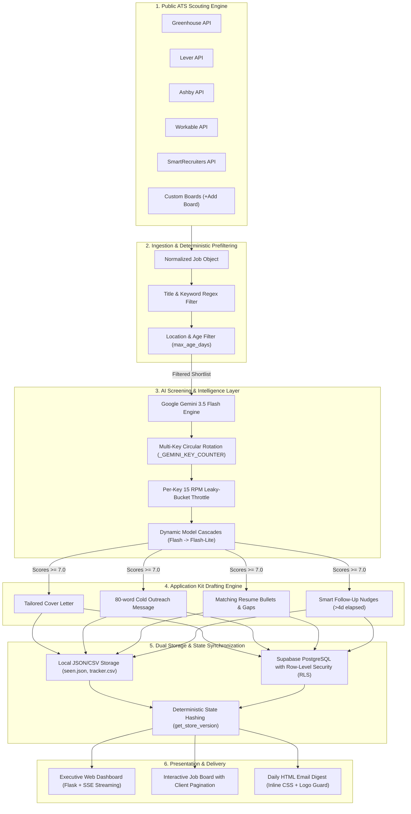

<p align="center">
  
</p>

# 🏛️ Job Hunter — System Architecture & Developer Handbook

Welcome to the **Job Hunter** developer architecture and onboarding guide. This document provides a structural, end-to-end breakdown of the system architecture, design patterns, module responsibilities, data pipelines, and developer workflows.

---

## 🧭 Executive Summary & Core Philosophy

**Job Hunter** is an autonomous, multi-tenant career intelligence platform that continuously scouts public, unauthenticated Applicant Tracking System (ATS) career boards, deterministically filters irrelevant noise at $0 API cost, leverages Google Gemini 3.5 Flash for high-throughput candidate fit scoring, generates custom application kits (tailored cover letters, networking cold outreach, and matching resume bullets), and delivers findings through an interactive single-page web dashboard and daily HTML briefings.

### Core Tenets
1. **The Hunter Never Fires Without Authorization**: The agent scouts, scores, and drafts—it never auto-submits applications. Final submission is always user-authorized.
2. **Zero-Cost Deterministic Filtering Before AI**: Heavy regex and location filters run before LLM invocation, saving ~99% of LLM token costs.
3. **Resilient Multi-Tier AI Provider Strategy**: Google Gemini 3.5 Flash is the default intelligence engine with circular multi-key CSV rotation, independent 15 RPM leaky-bucket throttling, and dynamic fallback cascades to `gemini-flash-latest` and `gemini-flash-lite-latest`.
4. **Pure Flexbox Fluid Layout**: The frontend uses 100% Flexbox styling (zero CSS Grid dependencies), providing an unclipped responsive experience down to 300px mobile viewports.
5. **Multi-Tenant Security by Default**: PostgreSQL Row-Level Security (RLS) guarantees complete tenant isolation; client-side view state isolation ensures authenticated views never leak to public visitors.

---

## 🗺️ System Architecture Diagram



---

## 📂 Repository Directory Map

```text
job-hunter/
├── assets/                      # Documentation-only vector diagrams & banners
│   ├── banner.svg               # Vector header banner
│   └── pipeline-flow.svg        # 5-phase automated architecture infographic
├── api/
│   ├── index.py                 # Vercel Serverless WSGI entrypoint
│   └── requirements.txt         # Pinned serverless dependencies
├── docs/                        # Complete technical documentation suite
│   ├── API.md                   # REST API contracts, routes, and JSON schemas
│   ├── ARCHITECTURE.md          # System architecture and developer handbook (this file)
│   ├── CHANGELOG.md             # Release history and notable changes
│   ├── CODE_OF_CONDUCT.md       # Community participation standards
│   ├── CONTRIBUTING.md          # Contribution rules, coding standards, and PR workflows
│   ├── DASHBOARD.md             # Web UI guide, state sync, and view isolation
│   ├── DEPLOYMENT.md            # Cloud deployment guide (Vercel, Supabase, GitHub Actions)
│   ├── ENGINE.md                # Prefilter, screening, and drafting pipeline details
│   ├── GUIDE.md                 # User workflows, daily automation, and CLI usage
│   ├── JOB_HUNT.md              # Search strategies and ATS ecosystem breakdown
│   ├── MULTI_USER.md            # Multi-tenant batch execution architecture
│   ├── METRICS.md               # Capacity, cost, and operational metrics
│   ├── SECURITY.md              # Vulnerability reporting and security controls
│   ├── SETUP.md                 # Step-by-step installation and configuration guide
│   └── TROUBLESHOOTING.md       # Diagnostic guide for common errors and rate limits
├── jobhunt/                     # Core Python Package
│   ├── __init__.py              # Package exports and version metadata (__version__ = "1.0.0")
│   ├── auth.py                  # JWT decoding, user context resolution, and @require_auth decorator
│   ├── clean.py                 # CLI tool for safely purging test fixtures and transient stores
│   ├── cli.py                   # Command-line interface dispatcher (run, scan, verify, stats)
│   ├── config.py                # YAML configuration parser with default fallbacks and validation
│   ├── digest.py                # Responsive HTML email digest builder with inline CSS and logo guard
│   ├── fetch.py                 # Job dataclass, @register_ats decorator, and 9 ATS board crawlers
│   ├── llm.py                   # Candidate screening, kit drafting prompts, and resilient JSON parsers
│   ├── mailer.py                # SMTP client with TLS encryption and failure recovery
│   ├── memory.py                # Supabase REST client with tenant-isolated Row-Level Security
│   ├── mock.py                  # Offline mock ATS fixtures for zero-network testing
│   ├── multi.py                 # Single-pass multi-tenant batch crawler and dispatcher
│   ├── parsers.py               # PDF resume text extraction and regex sanitizer
│   ├── prefilter.py             # Deterministic regex title, location, and date prefiltering
│   ├── providers.py             # Strategy pattern LLM clients (Gemini, Claude, Groq, Ollama)
│   ├── store.py                 # Local JSON state store with file locks and CSV export
│   ├── verify.py                # Live ATS endpoint auditor CLI tool
│   └── web/                     # Modular Flask Web Dashboard Backend
│       ├── __init__.py          # Application Factory (create_app), error handlers, and security headers
│       ├── state.py             # Circular SSE streaming log buffers and process state
│       └── routes/              # Modular Flask Blueprints
│           ├── views.py         # Landing view, dashboard shell, health checks, logo, and favicon
│           ├── jobs.py          # Jobs API, application stage transitions, custom ATS boards, CSV export
│           ├── profile.py       # Profile CRUD, notification settings, Resume Studio upload
│           └── pipeline.py      # Live on-demand pipeline runner, sync heartbeat, and SSE stream
├── static/                      # Frontend Assets
│   ├── css/
│   │   └── style.css            # 12-section pure Flexbox executive light mode design system
│   ├── js/
│   │   └── app.js               # SPA client controller, Supabase sync, job board pagination
│   └── assets/                  # Runtime logo and favicon assets
├── supabase/                    # Database Architecture
│   ├── schema.sql               # PostgreSQL schema: tables, indexes, and Row-Level Security policies
│   └── teardown.sql             # Idempotent database purge and reset script
├── templates/                   # Jinja2 HTML Templates
│   ├── index.html               # Main shell template with modern favicon tags and font preloads
│   └── partials/                # Modular UI partials
│       ├── add_company.html     # Custom ATS board ingestion modal (+ Add Board)
│       ├── add_job.html         # Manual job opportunity entry modal
│       ├── dashboard.html       # Executive dashboard layout, sidebar, workflow guide banner, job board
│       ├── kit_inspect.html     # Application kit modal with 1-click copy buttons
│       ├── landing.html         # Public landing hero and sign-in card
│       ├── navbar.html          # Navigation header, brand mark, and user context pill
│       ├── onboarding.html      # Onboarding wizard modal with role presets and Resume Studio
│       └── profile_settings.html # Profile editor, search filters, Resume Studio, and alert settings
├── tests/                       # Automated Test Suite (400 passing tests)
│   ├── conftest.py              # Pytest fixtures, mock state, and thread-safe provider reset
│   ├── test_api_jobs_stage.py   # Application pipeline stage transitions and email test endpoint
│   ├── test_app.py              # Web application factory, routes, static asset delivery
│   ├── test_auth.py             # View state isolation, JWT verification, and auth guards
│   ├── test_digest_mailer.py    # Email digest generation, responsive CSS, and logo guards
│   ├── test_flow_perfection.py  # End-to-end multi-provider and multi-tenant flows
│   ├── test_full_suite_perfection.py # Broad cross-subsystem perfection validation
│   ├── test_providers.py        # LLM provider rotation, throttling, and fallback cascades
│   └── ...                      # Comprehensive coverage across fetch, memory, store, etc.
├── app.py                       # Local Flask development server bootstrap
├── auto.py                      # Stable root automation entry point
├── companies.yaml               # Curated database of target companies and ATS platform slugs
├── config.example.yaml          # Template configuration file with full parameter documentation
├── scripts/                     # Cross-platform launchers and scheduled-task helpers
│   ├── run.bat / run.sh         # 1-click pipeline launchers
│   ├── apply.bat / apply.sh     # Application status helpers
│   └── setup_daily_task.bat     # Windows scheduled-task setup
├── pyproject.toml               # PEP 517/621 package specification, ruff, mypy, and pytest configs
├── requirements.txt             # Core pinned dependencies
└── vercel.json                  # Vercel serverless routing configuration
```

---

## 🧩 Architectural Design Patterns

### 1. Application Factory Pattern (`jobhunt.web.create_app`)
The web backend avoids global application instances by utilizing Flask's Application Factory pattern:
- Enables isolated testing with custom in-memory configurations.
- Attaches modular Blueprints (`views_bp`, `jobs_bp`, `profile_bp`, `pipeline_bp`).
- Configures security headers (`Content-Security-Policy`, `Permissions-Policy`, `X-Content-Type-Options`) and rate limiters (`flask-limiter`).

### 2. Strategy Pattern for AI Intelligence (`jobhunt.providers`)
The `LLMProvider` abstract base class decouples pipeline logic from specific model SDKs:
- **`GeminiProvider`**: Primary production engine with circular multi-key alternation (`_GEMINI_KEY_COUNTER`), independent per-key 15 RPM leaky-bucket throttling, and dynamic fallback cascades (`gemini-3.5-flash` $\rightarrow$ `gemini-flash-latest` $\rightarrow$ `gemini-flash-lite-latest`).
- **`ClaudeProvider`**: Optional Anthropic drop-in using native PDF document blocks.
- **`GroqProvider`**: Ultra-fast Llama-3.3-70B inference.
- **`OllamaProvider`**: 100% offline, local air-gapped inference.
- **`OpenAICompatibleProvider`**: Standard `/v1/chat/completions` endpoint integration.

### 3. Dual Storage Abstraction (`LocalMemory` vs `SupabaseMemory`)
The storage layer adapts transparently based on environment configuration:
- **Local Mode** (`seen.json` + `tracker.csv`): 100% database-free, zero-setup JSON store with file-locking semantics for personal desktop workflows.
- **Cloud Mode** (`SupabaseMemory`): PostgreSQL backend utilizing client JWT tokens for Row-Level Security (RLS), enabling multi-user SaaS deployments where each candidate's data is strictly isolated.

### 4. Extensible ATS Crawler Registry (`@register_ats`)
Adding support for a new ATS requires writing a single parser decorated with `@register_ats("platform_name")`:
```python
@register_ats("greenhouse")
def fetch_greenhouse(slug: str, session: requests.Session) -> list[Job]:
    url = f"https://boards-api.greenhouse.io/v1/boards/{slug}/jobs?content=true"
    resp = session.get(url, timeout=15)
    ...
```
The registry prevents duplicate registrations with warnings and handles URL auto-detection via `detect_ats_from_url()`.

---

## 🔄 Application Stage State Machine

Opportunities follow a strict 5-stage lifecycle managed through `POST /api/jobs/stage`:

```text
[to_apply] ──► [applied] ──► [interviewing] ──► [offer]
      │             │               │              │
      ▼             ▼               ▼              ▼
  [rejected]   [rejected]      [rejected]     [rejected]
```

- **`to_apply`**: Discovered high-fit posting; application kit generated and awaiting user review.
- **`applied`**: Application submitted by user. Automatically activates the 4-day follow-up nudge timer.
- **`interviewing`**: Screening or technical interview in progress.
- **`offer`**: Job offer received.
- **`rejected`**: Position closed or candidate archived.

---

## ⚡ Developer Quick-Start (< 2 Minutes)

### 1. Environment Setup
```bash
# Clone repository
git clone https://github.com/tanish-jain-225/job-hunter.git
cd job-hunter

# Create virtual environment
python -m venv .venv
source .venv/bin/activate  # On Windows: .venv\Scripts\activate

# Install dependencies
pip install -e ".[dev,web]"
```

### 2. Configure Environment
```bash
cp .env.example .env
# Edit .env and insert your Google Gemini API key:
# GEMINI_API_KEY=AIzaSy...
```

### 3. Run Development Server
```bash
python app.py
# Server starts at http://localhost:5000 with live UI and REST API
```

### 4. Run Test Suite & Quality Checks
```bash
# Run all 400 automated tests
pytest -q

# Run static type checker
mypy jobhunt

# Run linter
ruff check .
```

---

## 🛡️ Security & Tenant Isolation Model

1. **Row-Level Security (RLS)**: Enforced at the PostgreSQL level via `auth.uid() = user_id`. Even with direct database queries, tenants cannot access other users' records.
2. **Service Role Isolation**: Administrative batch execution (`jobhunt multi-run`) uses the Supabase service role key strictly during cron runs; web requests strictly pass user JWT tokens.
3. **No PDF Persistence**: Resumes uploaded to Resume Studio are parsed in-memory and discarded. Raw PDFs are never stored on disk or cloud buckets.
4. **Token Security**: Tokens are accepted solely via `Authorization: Bearer <token>` headers or secure HttpOnly cookies (complying with OWASP CWE-598). Query parameter token passing is blocked.
