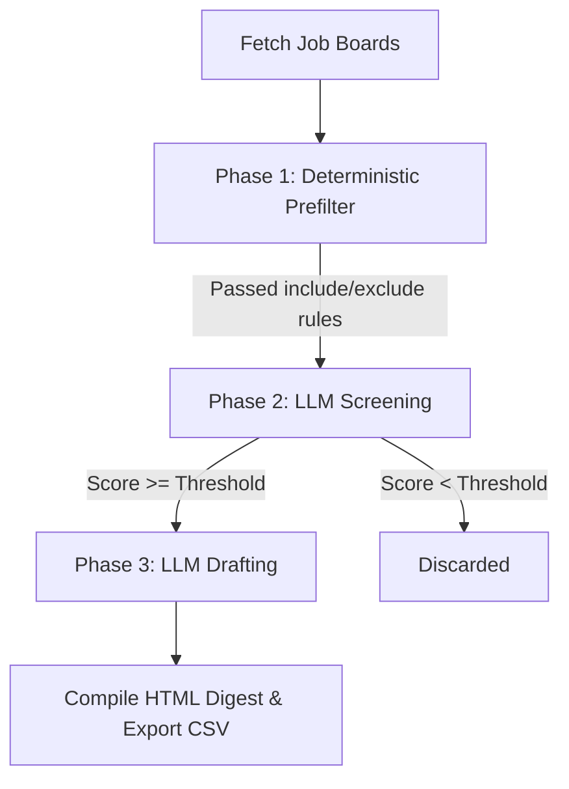

<p align="center">
  
</p>

# ⚙️ Job Matching & Scoring Engine Guide

The core power of **Job Hunter** lies in its deterministic filtering and two-stage LLM evaluation pipeline. The engine is optimized for **zero API costs**, **token efficiency**, and **high resilience** to network/API rate failures.

---

## 🏗️ Pipeline Phases

Each run executes a sequential funnel to filter down thousands of job postings into a few top matches.



### Phase 1: Deterministic Prefiltering (Deterministic & Free)
Before any LLM token is spent, all fetched postings are run through quick regex and date matches defined in [config.yaml](../config.yaml):
* **Include Titles:** Matches target roles (e.g., `software engineer`, `backend`, `intern`).
* **Exclude Titles:** Drops invalid matches (e.g., `senior`, `lead`, `ios`, `devops`).
* **Location Gate:** Checks if the posting matches target regions (e.g., `mumbai`, `bengaluru`) or allows `remote`.
* **Employment Type & Negation Gate:** Detects `remote`, `hybrid`, `onsite`, and `internship` roles with negation awareness (filtering out *"not remote"*, *"no internships"* false positives).
* **Date Freshness:** Discards jobs published longer than `max_age_days` (default `21` days) ago.

*Typically, this phase drops ~98% of jobs, reducing a crawl of 2,000 listings down to ~40 candidates for LLM screening.*

---

## 🤖 Phase 2: LLM Screening & Scoring (Token Efficient)

For the surviving postings, Job Hunter performs a cheap, batched evaluation pass to score how well the job description aligns with your resume profile.

### High-Throughput Batching & Cost Reduction
Rather than sending job descriptions one-by-one, Job Hunter batches **8 jobs per LLM call** (configured via `screen_batch_size`). It truncates each job description to **1,000 characters** (configured via `screen_jd_chars`), keeping rich context for evaluation.

When `GEMINI_API_KEY` is configured (with single key or multi-key CSV rotation `key1,key2,key3`), Job Hunter routes all batch screening to **Google Gemini (`gemini-3.5-flash`)**, leveraging Gemini's massive 1M token context window and 1,000,000+ daily tokens per project allowance at zero cost.

### Evaluation Criteria
The LLM is prompted to assign a score from **`0.0` to `10.0`** based on:
1. **Core Skills Match:** Does the candidate possess the required stack?
2. **Seniority Alignment:** Does the job match the target seniority level (e.g. Intern/Junior vs. Principal)?
3. **Domain Match:** Does the job domain align with the candidate's experience?
4. **India & Remote Eligibility:** Evaluates location compatibility for Indian and remote-friendly roles.

The LLM returns a JSON list:
```json
[
  {
    "job_id": "greenhouse:stripe:4089201",
    "score": 8.5,
    "reason": "Uses Python/React. Fits graduation timeline."
  }
]
```

---

## ✍️ Phase 3: LLM Drafting (Application Kit Generation)

Only jobs that score at or above the **`score_threshold`** (default `7.0/10`) progress to this stage. Here, the system performs a detailed, single-job analysis.

### High-Context Evaluation
The engine sends the full job description (up to **6,000 characters**, configured via `draft_jd_chars`) along with your full candidate profile. It routes to the configured AI provider (default: **Google Gemini `gemini-3.5-flash`**) to generate a complete application kit:

* **Fit Summary:** A brief 2-sentence summary of why this role is a strong match.
* **Tailored Resume Bullets:** 3 high-impact bullet points demonstrating skills matching the job requirements that you can insert into your resume.
* **Gaps Analysis:** An honest assessment of missing requirements and how to address them.
* **Cover Note:** A direct, professional outreach letter tailored directly to the hiring team.
* **Cold Outreach:** A concise (<80 words) direct message for LinkedIn/email networking.
* **Interview Questions:** 2 sharp technical questions showing thorough reading of the JD.

---

## ⏳ Phase 4: Smart Follow-Up Outreach Engine

For jobs in `applied` or `interviewing` stages, Job Hunter calculates the elapsed time since application date. If more than 4 days have elapsed without response:

* **Automated Nudges**: Injects `⏳ Xd ago · Follow Up` badges directly onto interactive job cards.
* **On-Demand Generation (`jobhunt.llm.generate_followup_note`)**: Produces context-aware follow-up templates:
  * **Email Subject & Body**: References the exact job title, company name, submission date, and reiterates enthusiasm without being pushy.
  * **LinkedIn Networking DM**: Compact (<80 words) direct message to connect with recruiters or hiring team members.
* **1-Click Copy**: Integrated into the Application Kit modal for instant clipboard copy.

---

## 🔌 AI Providers (`providers.py`)

Job Hunter routes all intelligence phases through the configured AI provider — **Google Gemini (`gemini-3.5-flash`)** by default, with Anthropic Claude, Groq, Ollama, and any OpenAI-compatible endpoint supported via env var overrides.

```env
GEMINI_API_KEY=AIzaSy_...        # Default: batch screening & rich drafting (1M tokens/day)
# LLM_PROVIDER=anthropic         # Optional override (requires ANTHROPIC_API_KEY)
# LLM_PROVIDER=groq              # Optional override (requires GROQ_API_KEY)
# LLM_PROVIDER=ollama            # Local, no key needed
```

### Key Capabilities

| Feature | Default Model | Config Key | Role in Job Hunter |
| :--- | :--- | :--- | :--- |
| **Stage 1: Fit Screening** | `gemini-3.5-flash` | `GEMINI_API_KEY` | High-throughput batch candidate screening (8 jobs/call, 15 RPM per-key pacing, multi-key rotation). |
| **Stage 2: Kit Drafting** | `gemini-3.5-flash` | `GEMINI_API_KEY` | Rich context window (6,000 chars) for personalized cover notes, cold DMs, & matching bullets. |
| **Native PDF Analysis** | `gemini-3.5-flash` | `GEMINI_API_KEY` | Base64 multimodal document parsing for resume profile extraction (also supported by Anthropic Claude). |

---

## 🛡️ Resilience & Fallback Mechanics

Job Hunter is built to ensure a scheduled crawl never fails due to network hiccups, API outages, or rate limits.

### 1. Offline Keyword Scorer Fallback
If your LLM provider is down, hits rate limits, or is not configured, the engine automatically falls back to the **Keyword Scorer** (defined in `jobhunt.llm`). 
* It scans the job text for keywords matching your `core_skills` (from `profile.json`).
* It assigns a score based on skill density.
* This allows the digest to still build and send with basic relevance matching, entirely offline!

### 2. Forgiving JSON Parser (`llm.parse_json`)
LLMs often wrap JSON outputs in Markdown code blocks (````json ... ````) or include conversational preambles/conversations. Job Hunter uses an intelligent, regex-backed parser that extracts only the valid JSON substring and handles missing brackets or commas gracefully, preventing model parsing errors from crashing runs.

### 3. Multi-Key Round-Robin & Model Cascading
* **Strict Primary Model**: Screening and drafting stages default strictly to **Google Gemini (`gemini-3.5-flash`)**.
* **Thread-Safe Key Alternation**: The engine implements a global atomic counter (`_GEMINI_KEY_COUNTER`) ensuring successive requests alternate across all configured API keys (`key1 -> key2 -> key3`).
* **Per-Key Independent 15 RPM Throttling**: Rather than stalling all keys under a shared timer, each key tracks its own last invocation timestamp (`_enforce_key_throttle(key, min_interval=4.0)`). During automated test execution (`PYTEST_CURRENT_TEST`), physical sleeps are cleanly bypassed, accelerating test suite execution by >80% while keeping production throttling 100% intact.
* **Extended 60s Generation Timeout**: Generous 60s read timeout (`TIMEOUT = 60`) prevents premature cutoffs on long JSON kits during upstream latency.
* **Automatic Model Cascading**: When `gemini-3.5-flash` hits Google AI Studio project limits (`HTTP 429: Resource Exhausted`) or transient high demand (`HTTP 503`), the engine automatically cascades the active payload through Google's production Flash endpoints (`gemini-flash-latest` → `gemini-flash-lite-latest`), with temporary cooldown tracking (`_MODEL_COOLDOWN_MAP`) ensuring continuous real-time execution without dropping candidates.
* **Deterministic Provider State Isolation**: The engine exports `reset_provider_state()` to atomically clear throttles, key counters, and model cooldowns, ensuring complete state isolation across production runs and automated tests (`tests/conftest.py`).

---

## 🔗 Documentation Links

- **[SETUP.md](SETUP.md)** — Complete step-by-step setup guide.
- **[GUIDE.md](GUIDE.md)** — Personal utility & cloud automation guide.
- **[DEPLOYMENT.md](DEPLOYMENT.md)** — Free-tier cloud production deployment guide.
- **[DASHBOARD.md](DASHBOARD.md)** — Web dashboard and REST API reference.
- **[MULTI_USER.md](MULTI_USER.md)** — Setting up multiple users.
- **[TROUBLESHOOTING.md](TROUBLESHOOTING.md)** — Troubleshooting and FAQs.
- **[CONTRIBUTING.md](CONTRIBUTING.md)** — Developer instructions and test suite.
- **[JOB_HUNT.md](JOB_HUNT.md)** — Original prompt & technical requirements specification.
- **[README.md](../README.md)** — Project homepage.


