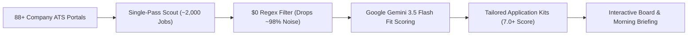

<p align="center">
  
</p>

# 📘 Job Hunter — End-to-End User Guide & Candidate Playbook

Welcome to **Job Hunter**! Whether you are a recent graduate, seasoned software engineer, tech lead, or career switcher, this guide covers everything you need to know to leverage Job Hunter as your 24/7 private, autonomous career intelligence agent.

---

## 📋 Table of Contents

1. [🧭 Core Philosophy & What Job Hunter Does](#1--core-philosophy--what-job-hunter-does)
2. [🚪 Accessing Job Hunter (Cloud SaaS vs. Local Web)](#2--accessing-job-hunter-cloud-saas-vs-local-web)
3. [👤 Step 1: Sign Up & Private Account Isolation](#3--step-1-sign-up--private-account-isolation)
4. [⚡ Step 2: The 2-Minute Onboarding Wizard](#4--step-2-the-2-minute-onboarding-wizard)
   - [Method A: Resume PDF/Text Upload (Resume Studio)](#method-a-resume-pdftext-upload-resume-studio)
   - [Method B: 1-Click Role Presets](#method-b-1-click-role-presets)
   - [Setting Target Titles & Excluded Keywords](#setting-target-titles--excluded-keywords)
   - [Setting Locations, Remote & Job Types](#setting-locations-remote--job-types)
   - [Choosing Your Email Briefing Mode](#choosing-your-email-briefing-mode)
5. [🛰️ Step 3: Launching Your First Autonomous Job Hunt](#5--step-3-launching-your-first-autonomous-job-hunt)
6. [📊 Step 4: Mastering the Interactive Job Board](#6--step-4-mastering-the-interactive-job-board)
   - [Understanding the AI Match Score (0.0 to 10.0)](#understanding-the-ai-match-score-00-to-100)
   - [Search, Filters & Responsive Pagination](#search-filters--responsive-pagination)
7. [✍️ Step 5: Unlocking AI Application Kits](#7--step-5-unlocking-ai-application-kits)
   - [Tailored Cover Letter](#tailored-cover-letter)
   - [80-Word LinkedIn Networking Cold DM](#80-word-linkedin-networking-cold-dm)
   - [Matching Resume Bullets & Skill Gaps](#matching-resume-bullets--skill-gaps)
   - [Interview Preparation Questions](#interview-preparation-questions)
8. [🚀 Step 6: Direct Applying & Pipeline Stage Tracking](#8--step-6-direct-applying--pipeline-stage-tracking)
   - [The 5-Stage Lifecycle](#the-5-stage-lifecycle)
   - [Submitting on the Official ATS](#submitting-on-the-official-ats)
9. [⏳ Step 7: Smart Follow-Up Outreach Engine](#9--step-7-smart-follow-up-outreach-engine)
10. [🏢 Step 8: Adding Custom Target Company Boards (`+ Add Board`)](#10--step-8-adding-custom-target-company-boards--add-board)
11. [📬 Step 9: Morning Briefing Digests in Your Inbox](#11--step-9-morning-briefing-digests-in-your-inbox)
12. [📁 Step 10: Data Export & Sheets Integration](#12--step-10-data-export--sheets-integration)
13. [💻 Step 11: Power User CLI & Local Workflows](#13--step-11-power-user-cli--local-workflows)
14. [🎯 The Job Hunter Playbook: Pro Tips to Land Offers](#14--the-job-hunter-playbook-pro-tips-to-land-offers)
15. [❓ Frequently Asked Questions (FAQ)](#15--frequently-asked-questions-faq)

---

## 1. 🧭 Core Philosophy & What Job Hunter Does

Finding a great job in technology shouldn't feel like a full-time unpaid job. Most candidates spend 10–15 hours every week scrolling through disjointed career portals, dodging stale listings, and writing generic cover letters.

**Job Hunter automates the entire discovery, evaluation, and drafting workflow for you:**



### The Golden Rule of Job Hunter
> [!IMPORTANT]
> **The Hunter never fires without manual authorization.**
> Job Hunter never auto-submits applications. It handles scouting, filtering, scoring, and drafting materials—leaving final submission strictly under your human control. You review every application before it goes out.

---

## 2. 🚪 Accessing Job Hunter (Cloud SaaS vs. Local Web)

You can use Job Hunter in whichever environment suits your workflow:

| Deployment Mode | Where It Runs | Best For | How to Access |
|---|---|---|---|
| **Cloud Web App** | Hosted on Vercel + Supabase | Anyone wanting a ready-to-use web app accessible from phone or laptop | Visit your deployment URL (e.g., `https://job-hunter-web-board.vercel.app`) |
| **Local Web App** | Runs on your local laptop (`localhost:5000`) | Developers wanting a private desktop instance | Run `python app.py` and open `http://localhost:5000` |
| **Terminal CLI** | Terminal command line | Automation scripts, headless servers, cron jobs | Run `jobhunt run` or `python auto.py` |

---

## 3. 👤 Step 1: Sign Up & Private Account Isolation

When you visit Job Hunter, you are greeted by the landing view:

1. Click **Get Started** or scroll to the authentication card.
2. Select the **Create Account** tab.
3. Enter your email and a secure password (minimum 6 characters), then click **Create Account & Start**.
4. *(Or click "Continue with Google" if Google OAuth is configured).*

### Why Your Data is 100% Private:
* Every user account is isolated by **PostgreSQL Row-Level Security (RLS)** in Supabase.
* Your resume text, target search criteria, tracked applications, interview notes, and custom company boards are strictly locked to your account ID. No other user or administrator can see your job pipeline.

---

## 4. ⚡ Step 2: The 2-Minute Onboarding Wizard

Upon your first sign in, the **Personalization Setup Wizard** opens automatically. You can also re-open this wizard at any time by clicking **Settings** in the top navigation bar.

### Method A: Resume PDF/Text Upload (Resume Studio)
1. In **Step 1: Resume & Profile**, drag and drop your resume file (`.pdf` or `.txt`) into the upload dropzone, or paste your resume text into the text area.
2. Click **Extract Candidate Profile with AI**.
3. In ~2 seconds, Job Hunter extracts:
   - Your full name
   - Current professional title
   - Years of experience
   - Core technical skills (languages, frameworks, tools)
4. Verify the extracted profile preview card. You can edit any details directly in the text editor before proceeding.
5. Click **Continue to Search Criteria →**.

> [!NOTE]
> **Privacy Invariant**: Job Hunter extracts resume text strictly in-memory. Binary PDF files are never stored on disk or serverless storage.

### Method B: 1-Click Role Presets
If you don't have a resume handy, click any of the 1-click role preset chips:
- 💻 **Full Stack** | ⚙️ **Backend** | 🎨 **Frontend** | 🧠 **AI / ML**
- ☁️ **DevOps / SRE** | 📊 **Data Eng** | 📱 **Mobile Dev** | 🧪 **QA / SDET**
- 🔒 **Security** | ⛓️ **Web3** | 🚀 **Product**

Clicking a preset automatically pre-fills industry-standard target titles and recommended skills!

### Setting Target Titles & Excluded Keywords
* **Target Job Titles**: Enter roles you want to target (comma-separated), for example:
  `Backend Engineer, Software Engineer, Full Stack Developer, AI Engineer, SDE II`
  *(Leave blank to screen all software engineering roles).*
* **Excluded Keywords**: Enter keywords to filter out roles you don't want:
  `Manager, Director, VP, Sales, Recruiter, iOS`

### Setting Locations, Remote & Job Types
* **Location Preference**:
  - 🇮🇳 **All India**: Considers openings across Bangalore, Mumbai, Hyderabad, Pune, Delhi-NCR, Chennai, and remote India.
  - 🌐 **Remote Only**: Restricts matches strictly to 100% work-from-home postings.
  - 📍 **Specific Cities**: Type your preferred cities (e.g. `Bangalore, Pune, Remote`).
  - 🌍 **Global**: Accepts opportunities worldwide.
* **Job Types**: Toggle Full-Time, 🎓 Internship, Remote, Hybrid, On-Site, Contract, or Part-Time.
* **Experience Level**: Choose your tier: *Fresher / Final Year*, *0–1 Year*, *1–3 Years*, *3–5 Years*, or *5+ Years*.

### Choosing Your Email Briefing Mode
Job Hunter lets you choose how you receive morning briefings:
1. 📬 **Daily 5:00 AM Radar (Recommended)**: Automatically receives a crisp HTML briefing in your inbox every morning whenever new high-match roles (score >= 7.0) are discovered.
2. ⚡ **Instant On-Demand**: Delivers an email briefing immediately whenever you click "Run Job Hunt Now" in the app.

Enter your notification email address, click **Complete & Launch First Hunt 🚀**, and you're ready!

---

## 5. 🛰️ Step 3: Launching Your First Autonomous Job Hunt

Once your profile is saved, you can trigger a live job hunt scan anytime:

1. Navigate to the **Sidebar Controls** on the left.
2. Click the primary button: **Run Job Hunt Now**.
3. Watch the real-time live console:
   - **Step 1: Crawling**: Scouts 88+ target company ATS boards across Greenhouse, Lever, Ashby, Workable, SmartRecruiters, BambooHR, Recruitee, Breezy HR, and Pinpoint (~10-15 seconds).
   - **Step 2: Prefiltering**: Eliminates ~98% of out-of-scope postings using fast $0 regex title and location rules.
   - **Step 3: AI Screening**: High-relevance candidates are batched (8 jobs/request) to Google Gemini 3.5 Flash to compute technical match scores (0.0 to 10.0).
   - **Step 4: Kit Drafting**: Application kits are drafted for top-scoring roles (>= 7.0).
   - **Step 5: Completion**: Results appear instantly on your interactive job board and in your HTML Daily Digest!

---

## 6. 📊 Step 4: Mastering the Interactive Job Board

Click the **Interactive Job Board** tab in the dashboard viewport to manage your opportunities.

### Understanding the AI Match Score (0.0 to 10.0)
Every evaluated role displays a color-coded match badge:

| Score Range | Color Badge | Meaning | Action Recommendation |
|---|---|---|---|
| **8.5 – 10.0** | 🟢 **High Match** | Strong alignment with your skills, seniority, and preferred location. | **Priority Apply Today** — Submit application immediately using the tailored kit. |
| **7.0 – 8.4** | 🟡 **Moderate Match** | Solid fit with minor skill or experience gaps. | **Apply** — Review gap analysis in the kit to highlight transferable skills. |
| **< 7.0** | ⚪ **Low Match** | Peripheral role or missing core technical requirements. | Review reason tag before deciding to apply. |

### Search, Filters & Responsive Pagination
* **Instant Search (`/` key shortcut)**: Press `/` on your keyboard to instantly focus the search bar. Filter by company name (e.g., `Stripe`), title (e.g., `Backend`), or city (e.g., `Bangalore`).
* **Filter by ATS Engine**: Use the ATS dropdown to view roles from specific platforms (`Greenhouse`, `Lever`, `Ashby`, `SmartRecruiters`, etc.).
* **Status Filter Pills**:
  - **All Jobs**: Shows all discovered opportunities.
  - **Applied**: Shows opportunities you have submitted applications for.
  - **Unapplied**: Shows fresh opportunities awaiting your review.
* **Sort Options**: Sort by **Match Score** (highest fit first), **Date** (newest postings first), or **Company Name**.
* **Responsive Pagination**: Toggle between **10**, **25**, or **50** jobs per page using the pagination controls at the bottom of the board.

---

## 7. ✍️ Step 5: Unlocking AI Application Kits

For every role that scores >= 7.0, Job Hunter generates a custom **AI Application Kit**. Click **Inspect Kit** on any job card to open the modal:

### 1. Tailored Cover Letter
* A professional, compelling cover note drafted specifically for the role and hiring team.
* Directly incorporates your past project accomplishments, technical stack, and passion for the company's product.
* Click **Copy Cover Note** to copy directly to your clipboard.

### 2. 80-Word LinkedIn Networking Cold DM
* A concise, polite networking message designed to send to engineering managers, recruiters, or team leads on LinkedIn or Twitter/X.
* Kept strictly under 80 words to maximize read rates and response likelihood.
* Click **Copy Cold DM** to copy to clipboard.

### 3. Matching Resume Bullets & Skill Gaps
* **Matching Bullets**: 3 high-impact bullet points demonstrating skills aligned with the job description that you can paste directly into your resume before applying.
* **Honest Gap Analysis**: Clearly outlines missing keywords or requirements in the job posting so you can prepare for technical interviews.

### 4. Interview Preparation Questions
* 2 insightful technical questions demonstrating deep understanding of the company's architecture to ask the interviewer at the end of your conversation.

---

## 8. 🚀 Step 6: Direct Applying & Pipeline Stage Tracking

### Submitting on the Official ATS
Job Hunter links directly to the **unauthenticated, public applicant tracking system (ATS)** endpoint for each role:
1. Click **Open Link** on any job card.
2. The official career portal (e.g., `jobs.ashbyhq.com/openai/uuid` or `boards.greenhouse.io/stripe/jobs/12345`) opens in a new tab.
3. Paste your tailored cover letter, attach your resume, and submit!

### The 5-Stage Lifecycle
Track your progress by changing the stage dropdown on the job card:

```text
📝 To Apply ──> 🚀 Applied ──> 💬 Interviewing ──> 🎉 Offer
                                    │
                                    └──> 📁 Archived (Rejected)
```

1. **`To Apply`**: Fresh opportunity discovered by the radar.
2. **`Applied`**: Submitted on the company ATS. Activates follow-up tracking!
3. **`Interviewing`**: Recruiter phone screen, technical assessment, or on-site interview scheduled.
4. **`Offer`**: Job offer extended. (Records in `Applied`, `Interviewing`, and `Offer` stages are **never auto-pruned** from your database).
5. **`Archived`**: Role filled or application declined.

---

## 9. ⏳ Step 7: Smart Follow-Up Outreach Engine

One of the biggest pain points in job hunting is knowing when and how to follow up after submitting an application.

Job Hunter handles this automatically:
1. When you mark a job as **Applied**, Job Hunter timestamps the application date.
2. If **4 or more days** elapse without a status update, a prominent alert badge appears on the job card:
   `⏳ 4d ago · Follow Up`
3. Click the badge to open the **Follow-Up Generator**:
   - **Email Subject Line & Body**: A courteous, professional nudge referencing the submission date and reiterating interest.
   - **LinkedIn InMail / DM**: A quick 50-word check-in message for the recruiter.
4. Click **Copy Follow-Up** and send!

---

## 10. 🏢 Step 8: Adding Custom Target Company Boards (`+ Add Board`)

Do you have dream companies that aren't in the default curated list? You can add them with 1 click:

1. In the tracker bar, click **+ Add Board**.
2. Paste the careers page URL of your target company, for example:
   - `https://jobs.ashbyhq.com/ramp`
   - `https://boards.greenhouse.io/figma`
   - `https://jobs.lever.co/notion`
   - `https://apply.workable.com/vector`
   - `https://jobs.smartrecruiters.com/visa`
3. Job Hunter's **auto-detection engine** instantly identifies the ATS engine and extracts the company slug.
4. Click **Verify & Add Board 🚀**.
5. Job Hunter verifies live HTTP reachability and registers the board under your private profile. It will now be crawled automatically on every scan!

---

## 11. 📬 Step 9: Morning Briefing Digests in Your Inbox

If you enabled daily email briefings, Job Hunter dispatches a clean, responsive HTML briefing directly to your inbox every morning:

* **Executive Summary**: Total roles scanned, candidates filtered, and high-match count.
* **Direct 1-Click Apply Buttons**: Opens the official ATS posting.
* **Match Score Badges**: Displays fit rating and bullet reason.
* **Inline Cold Outreach Snippets**: Read outreach text right from your phone.
* **Zero Spam Guarantee**: If no new roles pass your score threshold, Job Hunter delivers a clean zero-match digest so you know the radar ran, without cluttering your inbox.

---

## 12. 📁 Step 10: Data Export & Sheets Integration

Your job search data is always portable:
* Every time a job status changes or a new scan completes, Job Hunter updates `out/tracker.csv`.
* Open `out/tracker.csv` in **Microsoft Excel**, **Google Sheets**, or **Notion** to run custom analytics, track compensation numbers, or share progress with mentors.

---

## 13. 💻 Step 11: Power User CLI & Local Workflows

If you prefer terminal commands or want to automate scans on your local machine:

```bash
# 1. Quick dry-run without API keys using mock data
jobhunt run --mock --scorer keyword

# 2. Live scan with LLM scoring (prints results to terminal)
jobhunt run

# 3. Live scan + dispatch email digest
jobhunt run --send

# 4. View tracking statistics
jobhunt stats

# 5. Extract candidate profile from local resume file
jobhunt profile --resume path/to/resume.pdf

# 6. Mark a job as applied from terminal
jobhunt applied greenhouse:stripe:4089201

# 7. Audit live reachability across all company boards
jobhunt verify --workers 10

# 8. Clean temporary caches and test state
jobhunt clean
```

---

## 14. 🎯 The Job Hunter Playbook: Pro Tips to Land Offers

1. **Aim for 7.5+ Score Matches**: Quality beats volume. Applying to 5 roles with 8.5+ fit using tailored kits yields significantly higher interview rates than spraying 100 generic resumes.
2. **Pair the Cold DM with Every Application**: Immediately after submitting your application on the ATS, find an engineering manager or recruiter on LinkedIn and send the 80-word cold outreach DM drafted in your kit.
3. **Use the Tailored Bullets**: ATS keyword filters look for exact terminology. Replace 2–3 bullets on your resume with the tailored bullets generated in your Application Kit before submitting.
4. **Follow Up on Day 5**: Recruiter inboxes get flooded. Sending the polite follow-up nudge generated by Job Hunter on Day 4 or 5 puts your name back at the top of their inbox.
5. **Keep Your Profile Fresh**: Whenever you learn a new framework or complete a significant project, update your skills in **Settings** so the AI scoring accurately reflects your current capabilities.

---

## 15. ❓ Frequently Asked Questions (FAQ)

#### Q: Does Job Hunter submit applications automatically?
**A:** No. Job Hunter adheres strictly to the Golden Rule: *Human-in-the-loop authorization*. It scouts, filters, scores, and drafts materials, but you always review and submit the application yourself.

#### Q: How much does Job Hunter cost to use?
**A:** **$0.00 / month forever**. Google Gemini Flash (`gemini-3.5-flash`) offers 1,000,000+ free tokens per day, Supabase offers 500 MB free database storage, Vercel hosts the web app for free, and Gmail SMTP provides 500 free daily emails.

#### Q: Can I add companies that aren't in the default list?
**A:** Yes! Click **+ Add Board** in the tracker bar and paste any careers URL from Greenhouse, Lever, Ashby, Workable, SmartRecruiters, BambooHR, Recruitee, Breezy HR, or Pinpoint.

#### Q: What if I get a rate limit error with Google Gemini?
**A:** Job Hunter has built-in 4.0s hardware leaky-bucket pacing, multi-key CSV rotation (`GEMINI_API_KEY=key1,key2,key3`), and automatic fallback to an offline keyword matcher. It will never crash due to API rate limits.

#### Q: Can I use Job Hunter on my mobile phone?
**A:** Yes! The web dashboard is built with 100% Flexbox fluid layout and adapts down to 300px mobile viewports. You can review matches, inspect kits, copy cold DMs, and apply directly from your smartphone browser.

---

## 📚 Related Documentation

- **[SETUP.md](SETUP.md)** — Step-by-step installation, credential acquisition, and cloud deployment guide.
- **[ARCHITECTURE.md](ARCHITECTURE.md)** — System architecture, module breakdown, and data pipelines.
- **[DASHBOARD.md](DASHBOARD.md)** — Web dashboard and REST API endpoints.
- **[ENGINE.md](ENGINE.md)** — Technical details on regex prefiltering and Gemini scoring.
- **[MULTI_USER.md](MULTI_USER.md)** — Multi-tenant batch execution and RLS data governance.
- **[METRICS.md](../METRICS.md)** — Operational capacity, storage equilibrium, and cost economics.
- **[TROUBLESHOOTING.md](TROUBLESHOOTING.md)** — Solutions for common issues and diagnostics.
- **[README.md](../README.md)** — Project homepage.
