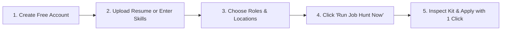
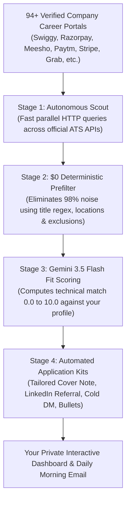
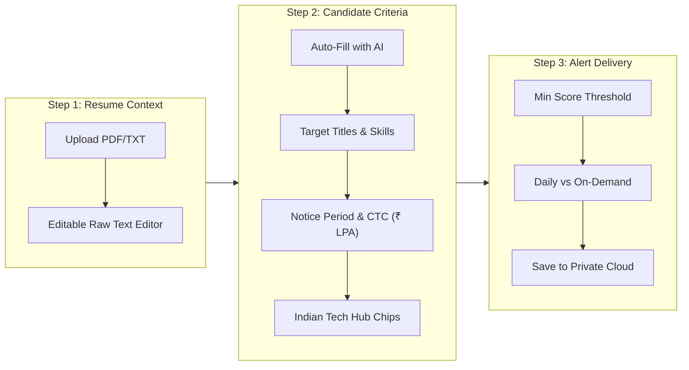

<p align="center">
  
</p>

# Job Hunter — Complete User Manual & Candidate Playbook

Welcome to **Job Hunter**! Whether you are a college student looking for your first summer internship, a recent graduate seeking a fresher / Graduate Engineer Trainee (GET) role, a mid-career developer eyeing a 30-day notice period transition, a seasoned tech lead negotiating a senior CTC, or a remote contractor seeking global clients—this manual is designed so that **anyone can master and use Job Hunter within 5 minutes**.

---

## 📖 Quick Glossary for Beginners

If you are new to technical hiring terms, here is everything you need to know in plain English:

| Term | What It Means | Why It Matters to You |
|---|---|---|
| **ATS (Applicant Tracking System)** | The software companies use to post jobs and receive resumes (e.g., Greenhouse, Lever, Ashby, Workable, SmartRecruiters). | Job Hunter queries these company portals directly via public APIs, bypassing noisy third-party scrapers. |
| **Match Score (0.0 – 10.0)** | A fit score computed by Google Gemini 3.5 Flash by comparing your specific skills and projects to the job description. | An 8.5+ score means you have a high probability of landing an interview; apply to these first! |
| **Notice Period** | How many days you must serve at your current company before joining a new employer (e.g., Immediate, 15d, 30d, 60d, 90d). | In Indian and global tech, notice period is often the very first filter recruiters check. |
| **CTC (Cost to Company) / LPA** | Total annual compensation package in **Lakhs Per Annum (₹ LPA)** (e.g., 18 LPA = ₹1,800,000 / year). | Job Hunter tracks compensation estimates and aligns salary expectations directly in your screening drafts. |
| **Application Kit** | A custom AI-generated package for high-scoring jobs containing a tailored cover note, a LinkedIn networking DM, a LinkedIn referral note, bullet points for your resume, and interview questions. | Saves you 30–45 minutes of writing per application with personalized, high-converting copy. |
| **Employee Referral** | When an existing employee submits your profile internally to the hiring manager. | Referrals have an 8–10x higher interview callback rate than cold ATS submissions. Job Hunter drafts an exact referral note for you. |

---

## ⚡ The 5-Minute Quick Start



1. **Open the Web App**: Go to your Job Hunter web URL (e.g., `http://localhost:5000` or your deployed Vercel URL).
2. **Create Your Account**: Enter your email and password. Your personal profile and saved jobs are completely private.
3. **Upload Your Resume**: Drop your PDF or text resume in **Settings** (or paste your skills and target titles).
4. **Click "Run Job Hunt Now"**: The radar scans 94+ curated tech career boards across 10,000+ postings in seconds.
5. **Inspect Your Application Kit**: Click **Inspect Kit** on any high-scoring role, copy the tailored cover letter or LinkedIn referral request, click **Open Link**, and submit your application!

---

## Table of Contents

1. [Core Philosophy & How the Engine Works](#1-core-philosophy--how-the-engine-works)
2. [Accessing Job Hunter (Cloud vs. Local vs. Terminal)](#2-accessing-job-hunter-cloud-vs-local-vs-terminal)
3. [Step 1: Sign Up & Private Account Isolation](#3-step-1-sign-up--private-account-isolation)
4. [Step 2: Candidate Profile Setup (3-Step Guided Studio)](#4-step-2-candidate-profile-setup-3-step-guided-studio)
   - [Step 1: Resume Upload & Context Extraction](#step-1-resume-upload--context-extraction)
   - [Step 2: Criteria, Indian Tech Hubs, Notice Period & CTC](#step-2-criteria-indian-tech-hubs-notice-period--ctc)
   - [Auto-Fill from Resume Context & Fallback Engine](#auto-fill-from-resume-context--fallback-engine)
   - [Step 3: Alert Thresholds & Delivery Modes](#step-3-alert-thresholds--delivery-modes)
5. [Step 3: Running Your First Autonomous Job Hunt](#5-step-3-running-your-first-autonomous-job-hunt)
6. [Step 4: Mastering the Dashboard & Interactive Board](#6-step-4-mastering-the-dashboard--interactive-board)
   - [Understanding the AI Match Score (0.0 to 10.0)](#understanding-the-ai-match-score-00-to-100)
   - [Location Quick-Filter (`India-Based`, `Remote-Friendly`, `All`)](#location-quick-filter-india-based-remote-friendly-all)
   - [Instant Search, ATS Filters & Sorting](#instant-search-ats-filters--sorting)
7. [Step 5: Unlocking AI Application Kits](#7-step-5-unlocking-ai-application-kits)
   - [1. LinkedIn Referral Request Note (<60 words)](#1-linkedin-referral-request-note-60-words)
   - [2. Tailored Cover Letter](#2-tailored-cover-letter)
   - [3. Recruiter Cold Outreach DM (<80 words)](#3-recruiter-cold-outreach-dm-80-words)
   - [4. Matching Resume Bullets & Skill Gaps](#4-matching-resume-bullets--skill-gaps)
   - [5. Technical Interview Questions](#5-technical-interview-questions)
8. [Step 6: Direct Applying & Pipeline Stage Tracking](#8-step-6-direct-applying--pipeline-stage-tracking)
9. [Step 7: Smart Follow-Up Outreach Engine](#9-step-7-smart-follow-up-outreach-engine)
10. [Step 8: Adding Custom Target Company Boards (`+ Add Board`)](#10-step-8-adding-custom-target-company-boards--add-board)
11. [Guide for Different Opportunity Types](#11-guide-for-different-opportunity-types)
    - [Internships & Fresher / Trainee Roles](#internships--fresher--trainee-roles)
    - [Full-Time SDE & Engineering Roles](#full-time-sde--engineering-roles)
    - [Contract & Freelance Opportunities](#contract--freelance-opportunities)
    - [100% Remote Global Opportunities](#100-remote-global-opportunities)
12. [Morning Briefing Digests in Your Inbox](#12-morning-briefing-digests-in-your-inbox)
13. [Data Export & Spreadsheet Analytics (CSV / Excel / Notion)](#13-data-export--spreadsheet-analytics-csv--excel--notion)
14. [Power User CLI & Local Workflows](#14-power-user-cli--local-workflows)
15. [The Winning Job Hunter Playbook: Pro Tips to Land Offers](#15-the-winning-job-hunter-playbook-pro-tips-to-land-offers)
16. [Frequently Asked Questions (FAQ)](#16-frequently-asked-questions-faq)

---

## 1. Core Philosophy & How the Engine Works

Most job seekers waste 10–15 hours every week browsing outdated aggregate job boards (where listings are often expired or reposted by third-party recruiters) and manually writing repetitive cover letters.

**Job Hunter eliminates this friction through a deterministic 4-stage scout-and-score funnel:**



### The Golden Rule of Job Hunter
> [!IMPORTANT]
> **The Hunter never fires without your authorization.**
> Job Hunter handles scouting, filtering, scoring, and drafting materials—leaving final submission strictly under your human control. You review every application before it goes out.

---

## 2. Accessing Job Hunter (Cloud vs. Local vs. Terminal)

Job Hunter is accessible across three flexible environments:

| Mode | Where It Runs | Best For | How to Access |
|---|---|---|---|
| **Cloud Web App** | Hosted on Vercel + Supabase | Anyone wanting a ready-to-use web app accessible from phone or laptop | Visit your deployed URL (e.g. `https://your-jobhunter.vercel.app`) |
| **Local Web App** | Runs on your local machine | Developers wanting an offline or private desktop instance | Run `python app.py` and open `http://localhost:5000` |
| **Terminal CLI** | Local command line | Terminal power users, headless servers, cron jobs | Run `jobhunt run` or `python auto.py` |

---

## 3. Step 1: Sign Up & Private Account Isolation

When you open Job Hunter:
1. Click **Get Started** on the hero banner.
2. Select the **Create Account** tab.
3. Enter your email address and choose a password (minimum 6 characters), then click **Create Account & Start**.
4. *(Optional: Click "Continue with Google" if Google OAuth is configured).*

### Why Your Data is 100% Private:
* Every user account is isolated by **PostgreSQL Row-Level Security (RLS)** in Supabase.
* Your resume text, target search criteria, compensation details, notice period, tracked applications, interview notes, and custom company boards are strictly locked to your account ID. No other user can ever view your job pipeline.

---

## 4. Step 2: Candidate Profile Setup (3-Step Guided Studio)

Configure your matching radar anytime by clicking **Settings** in the top navigation bar. The setup wizard is divided into 3 simple sections:



---

### Step 1: Resume Upload & Context Extraction

1. **Upload Resume**: Drag and drop your `.pdf` or `.txt` resume into the dropzone box, or click to browse.
2. **Instant Text Extraction**: The extracted text instantly appears in the editable text editor. You can freely edit, add recent projects, or type extra context.
3. **100% In-Memory Privacy**: Resume text extraction happens completely in-memory. Your raw PDF files are never uploaded to public storage buckets.
4. Click **Next: Profile & Search Criteria →** to proceed.

---

### Step 2: Criteria, Indian Tech Hubs, Notice Period & CTC

Step 2 centralizes all your candidate parameters and search preferences:

#### Auto-Fill from Resume Context & Fallback Engine
* Click **Auto-Fill from Resume Context** at the top of Step 2.
* Job Hunter reads your resume text and automatically populates:
  - **Candidate Name**
  - **Target Job Titles**
  - **Core Skills**
  - **Years of Experience** & **Education**
* **3-Tier Fallback Protection**: If upstream AI services experience rate limits or network issues, Job Hunter's built-in local regex engine takes over instantly in $\le 15$ seconds, accurately extracting your details without external dependencies.

#### Tailoring Your Parameters:
* **Candidate Name**: Your full name used in personalized Application Kits.
* **Target Job Titles (Included)**: Roles you want to match (e.g. `Software Engineer, Backend Developer, Full Stack Developer, AI Engineer, SDE Intern`).
* **Core Skills**: Comma-separated technical keywords (e.g. `Python, React, TypeScript, Node.js, Go, Docker, PostgreSQL`).
* **Years of Experience & Education**: E.g. `2` years, `B.Tech in Computer Science`.
* **Notice Period**: Select your availability from the dropdown:
  - **Immediate / Serving Notice** (highest recruiter priority)
  - **15 Days**
  - **30 Days** (standard for funded startups and product companies)
  - **60 Days**
  - **90 Days** (common in IT services)
* **Current & Expected CTC (₹ LPA)**: Enter your current and target compensation in Lakhs Per Annum (e.g. Current: `14`, Expected: `22`). This guides AI fit evaluation and referral outreach copy.
* **Excluded Title Keywords**: Words that cause a job to be dropped immediately during prefiltering (e.g. `Manager, Director, VP, Sales, Recruiter, iOS`).
* **Job Type Preferences**: Toggle chips for *Full-Time*, *Internship*, *Remote*, *Hybrid*, *Onsite*, *Contract*, or *Part-Time*.
* **Location Preference**:
  - **🇮🇳 All India**: Considers openings across all major Indian tech centers and remote India.
  - **🌐 Remote Only**: Restricts matches strictly to 100% work-from-home postings.
  - **📍 Specific Cities**: Allows entering custom cities (e.g. `Bengaluru, Pune, Remote`).
  - **🌍 Global (All Locations)**: Accepts opportunities worldwide.
* **Quick-Add Indian Tech Hub Chips**: Click any hub preset (`+ Bengaluru`, `+ Hyderabad`, `+ Pune`, `+ Delhi-NCR`, `+ Mumbai`, `+ Chennai`, `+ Remote India`) to add or remove it from your target cities list in one click!

---

### Step 3: Alert Thresholds & Delivery Modes

* **Minimum Match Score Threshold**: Choose a score between `1.0` and `10.0` (recommended: `7.5`). Only job opportunities meeting or exceeding this threshold appear on your primary board and in email digests.
* **Email Briefing Mode**:
  - **Daily Briefing (Recommended)**: Automated daily morning briefing sent when new matching roles are discovered.
  - **On-Demand Only**: Emails are sent only when you manually run a scan.
* **Notification Email**: The email address where your morning briefings should be sent.
* Click **Save Profile** to persist your profile securely to your private account.

---

## 5. Step 3: Running Your First Autonomous Job Hunt

Once your profile is saved, launching a job scan is as simple as clicking a button:

1. Look at the left sidebar or the top of the dashboard.
2. Click **Run Job Hunt Now**.
3. Watch the real-time execution log:
   - **Phase 1: Scout**: Queries 94+ career boards in parallel (~10–15 seconds).
   - **Phase 2: Prefilter**: Fast regex rules drop ~98% of irrelevant roles (wrong titles, excluded keywords, mismatched locations).
   - **Phase 3: AI Screening**: High-potential candidates are evaluated by Google Gemini 3.5 Flash to compute fit scores (0.0 to 10.0).
   - **Phase 4: Kit Drafting**: Tailored cover notes, LinkedIn cold outreach messages, and LinkedIn referral requests are drafted for top-scoring roles.
   - **Phase 5: Sync**: Discoveries appear immediately on your Interactive Job Board!

---

## 6. Step 4: Mastering the Dashboard & Interactive Board

Click the **Interactive Job Board** tab to manage and organize your opportunities.

### Understanding the AI Match Score (0.0 to 10.0)

Every role displays a color-coded match badge:

| Score Range | Color Badge | Meaning | Recommended Action |
|---|---|---|---|
| **8.5 – 10.0** | 🟢 **High Match** | Outstanding alignment with your core skills, experience level, and location. | **Priority Apply Today** — Use the tailored referral request or cover note immediately. |
| **7.0 – 8.4** | 🟡 **Moderate Match** | Strong fit with minor skill or framework gaps. | **Apply** — Review the gap analysis in the kit to highlight transferable skills. |
| **< 7.0** | ⚪ **Low Match** | Peripheral role or missing core requirements. | Review the reason tag before deciding to apply. |

### Location Quick-Filter (`India-Based`, `Remote-Friendly`, `All`)

Use the **Location Quick-Filter** dropdown in the tracker toolbar to slice your discovered opportunities instantly:
* **All Locations**: Displays all matching roles globally.
* **🇮🇳 India-Based**: Filters strictly for roles located in Indian tech hubs (Bengaluru, Hyderabad, Pune, Delhi-NCR, Mumbai, Chennai, etc.) or India-specific remote positions.
* **🌐 Remote-Friendly**: Filters strictly for 100% remote, work-from-home, or flexible hybrid roles.

### Visual Badges on Every Job Card
Each opportunity card provides instant visual context:
* **`🇮🇳 India` Pill**: Indicates that the role is based in an Indian tech center.
* **`💰 ₹ LPA` / Stipend Badge**: Displays extracted compensation ranges (e.g. `₹ 18-24 LPA` or `₹ 35,000/mo Stipend`) when available.
* **`ATS` Tag**: Shows the underlying system (e.g., `Greenhouse`, `Lever`, `Ashby`).
* **`Match Score` Badge**: Shows your calculated fit score (e.g., `8.8 / 10`).

### Instant Search, ATS Filters & Sorting
* **Instant Search (`/` key)**: Press `/` on your keyboard to instantly focus the search input. Search by company (e.g. `Swiggy`), title (e.g. `Full Stack`), or city (e.g. `Pune`).
* **Filter by ATS Engine**: View jobs specifically from `Greenhouse`, `Lever`, `Ashby`, `Workable`, `SmartRecruiters`, etc.
* **Status Filter Tabs**: Switch between **All Opportunities**, **Applied**, **To Apply**, **Internships**, or **Remote**.
* **Sorting**: Sort by **Match Score** (highest fit first), **Date** (newest first), or **Company Name**.

---

## 7. Step 5: Unlocking AI Application Kits

For every role with a match score $\ge 7.0$, Job Hunter generates a comprehensive **AI Application Kit**. Click **Inspect Kit** on any card to open the kit modal:

```text
┌─────────────────────────────────────────────────────────────┐
│ Opportunity Details: Software Development Engineer 2        │
│ Swiggy · Bengaluru, India · 🇮🇳 India-Based · Notice: 30 days│
├─────────────────────────────────────────────────────────────┤
│ 1. 💼 LinkedIn Referral Request (<60 words)   [Copy Note]   │
│ 2. 📝 Tailored Cover Letter                   [Copy Note]   │
│ 3. 💬 Recruiter Cold Outreach DM (<80 words)  [Copy DM]     │
│ 4. 🎯 Tailored Resume Highlights (3 Bullets)                │
│ 5. ⚠️ Honest Skill Gaps & Interview Prep Questions          │
└─────────────────────────────────────────────────────────────┘
```

### 1. LinkedIn Referral Request Note (<60 words)
* **Why it matters**: In tech recruiting, applying through an employee referral gives your resume an 8–10x higher response rate and bypasses automated ATS rejection queues.
* **How it works**: Job Hunter creates a polite, concise peer-to-peer note citing the exact Job ID, matching tech stack, and your notice period.
* **How to use it**:
  1. Click **Copy Referral Note**.
  2. Find an engineer or tech lead at the target company on LinkedIn.
  3. Send a connection request with the note attached!

### 2. Tailored Cover Letter
* A compelling, professional cover note written specifically for the company's product and mission.
* Directly weaves in your relevant projects and experience.
* Click **Copy Note** to paste into the official application form.

### 3. Recruiter Cold Outreach DM (<80 words)
* An ultra-concise networking message designed for LinkedIn InMail or Twitter/X DMs to recruiters and hiring managers.
* Kept strictly under 80 words to maximize readability on mobile screens.
* Click **Copy Outreach** to send.

### 4. Matching Resume Bullets & Skill Gaps
* **Resume Bullets**: 3 high-impact bullet points demonstrating skills aligned with the job description. Paste these directly into your resume to ensure ATS keyword alignment.
* **Honest Gap Analysis**: Highlights requirements mentioned in the job description that were not prominently found in your resume, so you can prepare technical answers in advance.

### 5. Technical Interview Questions
* 2 insightful architectural questions to ask the interviewer at the end of your call, demonstrating genuine interest and engineering depth.

---

## 8. Step 6: Direct Applying & Pipeline Stage Tracking

Job Hunter makes applying fast and transparent:

1. Click **Open Link** on any job card.
2. The official, authentic company career page opens in a new tab (e.g. `jobs.ashbyhq.com/...`, `boards.greenhouse.io/...`, or `jobs.lever.co/...`).
3. Fill out the application, paste your tailored cover note, attach your resume, and submit.
4. Return to Job Hunter and update the stage dropdown to **Applied** (or click **Mark Applied**).

### The 5 Pipeline Stages

```text
 To Apply ──>  Applied ──>  Interviewing ──>  Offer
                                    │
                                    └──>  Archived (Declined/Closed)
```

1. **`To Apply`**: Fresh discovery awaiting your review.
2. **`Applied`**: Application submitted. Activates follow-up tracking!
3. **`Interviewing`**: Recruiter phone screen, take-home assessment, or technical interview scheduled.
4. **`Offer`**: Formal offer received! *(Records in Applied, Interviewing, and Offer are never auto-pruned).*
5. **`Archived`**: Role closed, filled, or declined.

---

## 9. Step 7: Smart Follow-Up Outreach Engine

Recruiters receive hundreds of resumes every week. A polite follow-up nudge dramatically boosts response rates:

1. When you mark a role as **Applied**, Job Hunter timestamps the date.
2. If **4 or more days** elapse without a status update, a follow-up badge appears automatically on the job card:
   `4d ago · Follow Up`
3. Click the badge to open the **Follow-Up Generator**:
   - Generates a courteous follow-up email draft citing the submission date and role title.
   - Generates a 40-word LinkedIn check-in message.
4. Click **Copy Follow-Up** and send!

---

## 10. Step 8: Adding Custom Target Company Boards (`+ Add Board`)

Want to track companies that aren't in the default curated list? You can add any company with 1 click:

1. In the toolbar, click **+ Add Board**.
2. Paste the careers page URL of your target company, for example:
   - `https://jobs.ashbyhq.com/ramp`
   - `https://boards.greenhouse.io/figma`
   - `https://jobs.lever.co/notion`
   - `https://apply.workable.com/vector`
   - `https://jobs.smartrecruiters.com/visa`
3. Job Hunter automatically detects the ATS platform and extracts the company slug.
4. Click **Verify & Add Board**.
5. Job Hunter checks live HTTP reachability and registers the company under your private account. It will now be scouted on every scan!

---

## 11. Guide for Different Opportunity Types

Job Hunter adapts to every candidate situation:

### Internships & Fresher / Trainee Roles
* **How to configure**:
  - In **Settings**, toggle the **Internship** chip.
  - Set Experience Level to **Fresher / Entry Level (0-1 yrs)**.
  - Add target titles like `Software Engineer Intern, Graduate Engineer Trainee, GET, Associate Software Engineer`.
* **What Job Hunter does**: Detects stipend numbers (e.g. `₹ 40,000/mo Stipend`), matches college projects and hackathons, and drafts beginner-friendly referral notes.

### Full-Time SDE & Engineering Roles
* **How to configure**:
  - In **Settings**, toggle **Full-Time**.
  - Select your **Notice Period** (`Immediate`, `15 Days`, `30 Days`, `60 Days`, `90 Days`).
  - Enter your **Current CTC** and **Expected CTC** in ₹ LPA.
  - Select your preferred Indian Tech Hubs using the quick-add chips.
* **What Job Hunter does**: Matches exact framework competencies, injects notice period into outreach messages, and checks compensation fit.

### Contract & Freelance Opportunities
* **How to configure**:
  - In **Settings**, toggle the **Contract** chip.
  - In target titles, add keywords like `Contract, Consultant, Freelance`.
* **What Job Hunter does**: Scans listings for duration hints (`6 Month Contract`, `Fixed-Term Contract`) and hourly/daily rates.

### 100% Remote Global Opportunities
* **How to configure**:
  - In **Settings**, toggle **Remote Only** or set Location Preference to **Global**.
  - Leave specific cities blank or add `Remote`.
* **What Job Hunter does**: Identifies worldwide remote roles while automatically rejecting regional lockouts (e.g. "US Only" or "Must reside in North America").

---

## 12. Morning Briefing Digests in Your Inbox

If you enable daily briefings in **Settings**, Job Hunter sends a clean, responsive HTML summary directly to your inbox every morning:

* **Executive Radar Metrics**: Total postings scanned, candidates filtered, and high-match count.
* **Top Matching Opportunities**: Direct 1-click apply links, match score badges, and why-it-fits summaries.
* **Inline Outreach Copy**: Preview referral notes and cover letters directly from your smartphone.
* **Zero Spam Guarantee**: On days when zero roles meet your threshold, a clean zero-match digest confirms the radar ran successfully without cluttering your inbox.

---

## 13. Data Export & Spreadsheet Analytics (CSV / Excel / Notion)

Your data is always portable:
* Every time a job status changes or a new scan finishes, Job Hunter writes an updated CSV snapshot to `out/tracker.csv`.
* Open `out/tracker.csv` in **Microsoft Excel**, **Google Sheets**, or import it into **Notion** to run custom analytics, track interview dates, or log recruiter conversations.

---

## 14. Power User CLI & Local Workflows

If you prefer terminal commands or want to automate scans on your local workstation:

```bash
# 1. Quick dry-run without API keys using mock data
jobhunt run --mock --scorer keyword

# 2. Live scan with LLM scoring (prints results to terminal)
jobhunt run

# 3. Live scan + dispatch morning email digest
jobhunt run --send

# 4. View tracking statistics
jobhunt stats

# 5. Extract candidate profile from local resume file
jobhunt profile --resume path/to/resume.pdf

# 6. Mark a job as applied from terminal
jobhunt applied greenhouse:razorpay:12345

# 7. Audit live reachability across all company boards
jobhunt verify --workers 10

# 8. Clean temporary caches and test state
jobhunt clean

# 9. Multi-tenant batch run across all registered users
jobhunt multi-run --send

# 10. Targeted batch run for a single user
jobhunt multi-run --user-email candidate@example.com --send
```

---

## 15. The Winning Job Hunter Playbook: Pro Tips to Land Offers

1. **Prioritize 8.5+ Match Scores**: Applying thoughtfully to 5 high-scoring roles yields far better results than spamming 100 generic applications.
2. **Always Use the LinkedIn Referral Note First**: Before submitting on the ATS, look up an engineering peer or alumni from your university working at the company. Send the LinkedIn referral note generated in your kit.
3. **Align Resume Bullets with the Kit**: ATS screeners look for specific technical terms. Replace 2–3 bullet points on your resume with the tailored highlights from your kit before submitting.
4. **Follow Up on Day 4 or 5**: Recruiters are busy. Sending the polite follow-up nudge generated by Job Hunter puts your profile back at the top of their inbox.
5. **Keep Your Skills Fresh**: When you learn a new library, framework, or cloud tool, add it to your profile in **Settings** so the AI scoring algorithm rewards your new skills.

---

## 16. Frequently Asked Questions (FAQ)

#### Q: Does Job Hunter submit applications automatically?
**A:** No. Job Hunter adheres strictly to the Golden Rule: *Human-in-the-loop authorization*. It scouts, filters, scores, and drafts materials, but you always review and submit the application yourself.

#### Q: How much does Job Hunter cost to use?
**A:** **$0.00 / month forever**. Google Gemini Flash (`gemini-3.5-flash`) offers generous free daily quotas, Supabase provides free database storage, Vercel hosts the web app for free, and Gmail SMTP provides 500 free daily notification emails.

#### Q: Can I add companies that aren't in the default list?
**A:** Yes! Click **+ Add Board** in the tracker toolbar and paste any careers URL from Greenhouse, Lever, Ashby, Workable, SmartRecruiters, BambooHR, Recruitee, Breezy HR, or Pinpoint.

#### Q: Can I use Job Hunter on my phone?
**A:** Yes. The web interface is fully mobile responsive. You can inspect kits, copy referral notes, and open career postings directly from your smartphone browser.

#### Q: What if I get 0 matching jobs after running a scan?
**A:** If you receive zero matches, try:
1. Adding more job title variations in **Settings** (e.g. adding `Software Engineer` alongside `Backend Developer`).
2. Selecting **All India** or adding **Remote** to your location preferences.
3. Slightly lowering your Minimum Match Score Threshold (e.g. from `8.0` to `7.0`).

#### Q: How does Job Hunter handle notice periods in India?
**A:** You can select your notice period (`Immediate`, `15 Days`, `30 Days`, `60 Days`, `90 Days`) in Settings. This value is saved to your profile and automatically injected into your LinkedIn referral notes and cold outreach messages so recruiters know your availability upfront.

---

## Related Documentation

- **[SETUP.md](SETUP.md)** — Step-by-step installation, credential acquisition, and cloud deployment guide.
- **[ARCHITECTURE.md](ARCHITECTURE.md)** — System architecture, module breakdown, and data pipelines.
- **[DASHBOARD.md](DASHBOARD.md)** — Web dashboard and REST API endpoints.
- **[ENGINE.md](ENGINE.md)** — Technical details on regex prefiltering and Gemini scoring.
- **[MULTI_USER.md](MULTI_USER.md)** — Multi-tenant batch execution and RLS data governance.
- **[METRICS.md](METRICS.md)** — Operational capacity, storage equilibrium, and cost economics.
- **[TROUBLESHOOTING.md](TROUBLESHOOTING.md)** — Solutions for common issues and diagnostics.
- **[README.md](../README.md)** — Project homepage.
