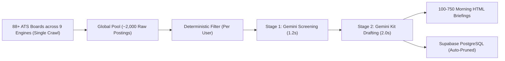
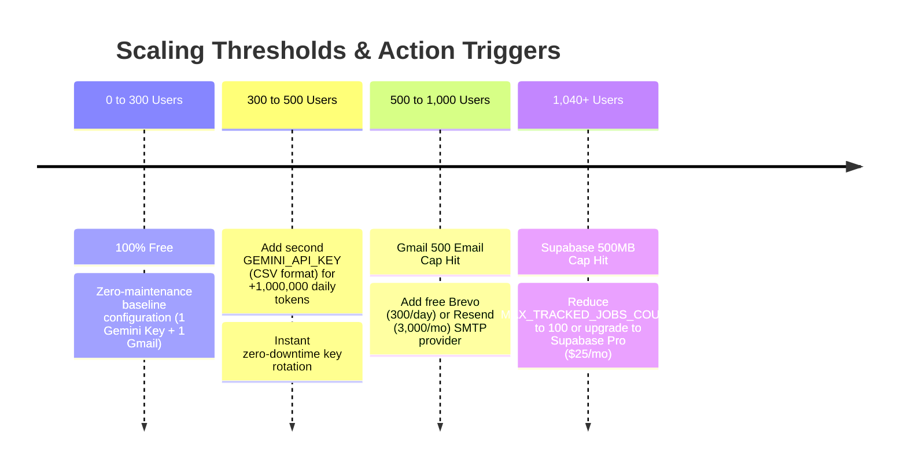

  

# Job Hunter - Operational Metrics and Limits

This document outlines the operational capacity, resource consumption, infrastructure scaling thresholds, and cost economics of the **Job Hunter** autonomous career intelligence platform.

---

## 1. Executive Summary

Job Hunter uses a centralized multi-user batch architecture. Instead of crawling
job boards separately for every user, the worker can execute a single-pass crawl
and evaluate candidate profiles against the shared result pool.

Actual capacity and cost depend on provider plans, configured users, job volume,
AI latency, email volume, and retention. The figures in this document are
planning estimates, not guarantees.

---

## 2. Multi-User Scale & Workload Matrix

| Metric | 100 Users | 250 Users | 500 Users | 750 Users | 1,500 Users |
|---|:---:|:---:|:---:|:---:|:---:|
| **Daily Discovered Jobs** | ~2,000 | ~2,000 | ~2,000 | ~2,000 | ~2,000 |
| **ATS Crawl Requests** | ~88 | ~88 | ~88 | ~88 | ~88 |
| **Stage 1 Screening Calls (Gemini)** | ~300 | ~750 | ~1,500 | ~2,250 | ~4,500 |
| **Stage 2 Kit Drafting Calls (Gemini)** | ~300 | ~750 | ~1,500 | ~2,250 | ~4,500 |
| **Emails Dispatched / Day** | 100 | 250 | 500 | 750 | 1,500 |
| **Daily Cron Runtime (GitHub Actions)** | ~2.5 mins | ~4.5 mins | ~8.5 mins | ~14 mins | ~25 mins |
| **Permanent DB Size Plateau** | ~25 MB | ~62.5 MB | ~125 MB | ~187.5 MB | ~375 MB |
| **Total Monthly Running Cost** | **$0.00** | **$0.00** | **$0.00** | **$0.00** | **~$10 – $15** |
| **Free Tier Status** |  100% Free (1 Key) |  100% Free (1 Key) |  100% Free (2 CSV Keys) |  100% Free (3 Keys + Free Multi-SMTP) |  Paid Expansion |

---

## 3. Component-by-Component Infrastructure Breakdown & Bottlenecks

### Summary Service Capacity Audit (Lowest to Highest)

| Service / Infrastructure | Free Quota | Consumption / User | Hard Free User Cap | Bottleneck Status |
|---|---|---|:---:|---|
| **Google Gemini AI (1 Key)** | 1,500 req/day & 1M tokens/day | ~4.5 requests/day | **300 Users** | 🛑 **Primary Ceiling** (out-of-the-box) |
| **Gmail SMTP** | 500 emails / 24 hours | 1 email digest / day | **500 Users** | 🛑 **Secondary Ceiling** (1 account) |
| **Supabase PostgreSQL** | 500 MB DB disk & 50,000 MAU | ~450 KB (300-job FIFO window) | **1,040 Users** | 🛑 **Storage Ceiling** (database disk) |
| **GitHub Actions** | 2,000 mins/mo (or unlim. if public) | ~1.0s / user in batch pass | **1,500 Users** | ✅ 25 min daily schedule headroom |
| **Vercel Hobby** | 100 GB monthly bandwidth | ~15 MB / user / month | **6,600 Users** | ✅ High headroom |
| **9 ATS Board Crawlers** | Public JSON endpoints (88+ boards) | 0 extra (single global pass) | **Unlimited** | ✅ Completely independent of user volume |

### A. Primary AI Engine: Google Gemini Flash (`gemini-3.5-flash`)
* **Default Model**: `gemini-3.5-flash`
* **Batch Size**: 8 jobs per screening request (high-throughput evaluation pass).
* **Batch Pacing**: 4.0s hardware delay between requests per key = 15 RPM exact speed matching (with 6.0s default config delay = 10 RPM; dynamically accelerated via multi-key round-robin rotation `_GEMINI_KEY_COUNTER` and independent per-key tracking).
* **Multi-Key CSV Rotation**: Instant zero-downtime rotation across comma-separated keys (`GEMINI_API_KEY=key1,key2,key3`).
* **Daily Free Quota**: **1,500 requests / day** and **1,000,000+ tokens / day** per project key.
* **Per-User Daily Consumption**: ~3–5 API calls at steady state (1–2 screening batches for incremental daily roles + 1–3 kit drafts for top matches).
* **Capacity**:
  * **1 Gemini API Key**: 300 Daily Active Users (**100% Free Forever**)
  * **2 Gemini API Keys**: 500 Daily Active Users (**100% Free Forever**)
  * **3 Gemini API Keys**: 750 Daily Active Users (**100% Free Forever**)

### B. Database & Multi-Tenant Storage (Supabase PostgreSQL)
* **Free Tier Quota**: **500 MB Database Storage** & **50,000 Monthly Active Users**.
* **Storage Invariant**: Every user profile is capped at a rolling retention window of **300 unapplied jobs** (`jobhunt/store.py:prune_old_jobs`).
* **Protected Records**: Jobs marked `Applied`, `Interviewing`, or `Offer` are **never pruned**.
* **Storage Plateau**:
  * Average size per stored job kit: **~1.5 KB**
  * 300 jobs $\times$ 1.5 KB = **~450 KB per user**
  * 300 Users = **~135 MB total** (Uses **27%** of 500 MB free tier).
  * 1,040 Users = **~470 MB total** (Uses **94%** of 500 MB free tier).

### C. Daily Briefing Dispatch (Gmail SMTP)
* **Free Outbound Limit**: **500 emails / 24 hours** per Google Account.
* **Capacity**:
  * 100 Users: 100 emails (**20%** of limit)
  * 300 Users: 300 emails (**60%** of limit)
  * 500 Users: 500 emails (**100%** of limit — hard ceiling for 1 standard Gmail account).
  * *Scaling beyond 500*: Add free SMTP services (Brevo: 300 emails/day free; Resend: 3,000 emails/mo free).

### D. Compute & Automation (GitHub Actions Cloud)
* **Free Monthly Minutes**: **2,000 minutes / month** (or unlimited if repository is public).
* **Schedule**: Daily at **05:00 AM IST** (`30 23 * * *`).
* **Capacity**:
  * 100 Users: ~2.5 min/day $\times$ 30 = **75 mins/mo** (**3.75%** of quota)
  * 250 Users: ~4.5 min/day $\times$ 30 = **135 mins/mo** (**6.75%** of quota)
  * 500 Users: ~8.5 min/day $\times$ 30 = **255 mins/mo** (**12.75%** of quota)

### E. Quality Assurance & Test Verification
* Run `pytest -q` for the current automated test count.
* Run `pytest --cov=jobhunt --cov-report=term-missing` for current coverage.
* Runtime varies by machine and test environment.
* **Python Runtime Matrix**: Continuously tested and certified across Python 3.9, 3.10, 3.11, and 3.12.

---

## 4. The Steady-State Storage Equilibrium Model

Traditional databases grow indefinitely over time ($O(N \times T)$), eventually causing disk crashes. Job Hunter uses an **$O(N)$ bounded sliding window**:

$$\text{Database Storage}(t) = N_{\text{users}} \times \left( M_{\text{active\_jobs}} \times S_{\text{job\_record}} + M_{\text{applied\_jobs}} \times S_{\text{job\_record}} + S_{\text{profile}} \right)$$

Where:
* $M_{\text{active\_jobs}} \le 300$ (enforced by FIFO pruning)
* $S_{\text{job\_record}} \approx 1.5 \text{ KB}$
* $S_{\text{profile}} \approx 2.0 \text{ KB}$

**Result**: After ~45 days of initial scan accumulation, storage stops growing and reaches a permanent, stable equilibrium plateau.

---

## 5. Scaling Thresholds & Friction Milestones

---

## 6. Real-World Risk & Mitigation Playbook

| Risk Factor | Impact | Mitigation Strategy |
|---|---|---|
| **AI Provider Free Tier Changes / Rate Limits (TPM/429)** | Provider reduces limits or hits 429 quota spikes | Multi-key CSV key rotation (`GEMINI_API_KEY=key1,key2`) + 4.0s–6.0s leaky bucket throttle + automatic fallback to deterministic keyword scorer. |
| **ATS Anti-Scraping Policies** | ATS adds bot challenge on public endpoints | All 9 supported ATS engines use standard public JSON career APIs that have remained open for over a decade. Proxy rotation can be enabled if needed. |
| **Email Deliverability (Spam Filter)** | High-volume emails from `@gmail.com` land in spam | For >300 users, connect a custom domain with verified SPF, DKIM, and DMARC DNS records via Amazon SES or Resend. |
| **GitHub Access Token Expiration** | Workflow dispatch fails to trigger | Set GitHub Personal Access Tokens (`GH_TOKEN`) with "No Expiration" or rotate annually. |

---

## 7. Commercial Competitor Benchmarking & Pricing Analysis

Commercial job search platforms charge substantial recurring subscription fees while relying on manual user bookmarking or risky automated bots that trigger recruiter spam filters.

### Head-to-Head Competitor Comparison

| Platform | Model / Category | User Pricing | Annual Cost / User | Sourcing Method | Application Safety | AI Intelligence |
|---|---|:---:|:---:|---|---|---|
| **Job Hunter** | **Autonomous Career Intelligence** | **$0.00 / mo** | **$0.00** | **Direct Public ATS APIs** (88+ boards across 9 engines) | **The Golden Rule** (Scout & Draft; Human Submits) | **Google Gemini 3.5 Flash** (1M context, multi-key rotation, 0% fallback) |
| **Teal (`tealhq.com`)** | Manual Tracker & Resume Builder | $29 – $40 / mo ($9/wk) | $348 – $480 | ❌ None (Manual Chrome extension bookmarking) | Human Submits | Standard GPT-4o-mini |
| **Huntr (`huntr.co`)** | Kanban Board & AI Tailor | $30 – $40 / mo | $360 – $480 | ❌ None (Manual Chrome extension bookmarking) | Human Submits | Standard GPT-4o-mini |
| **LoopCV (`loopcv.pro`)** | Auto-Apply Bot | €10 – €40 / mo | ~$130 – $500 | ⚠️ Aggregator scraping (LinkedIn, Indeed) | ⚠️ Spray-and-Pray Bot (High ATS blacklist risk) | Heuristic template filler |
| **LazyApply (`lazyapply.com`)** | Chrome Auto-Apply Bot | $19 – $39 / mo or $249 life | ~$230 – $470 | ⚠️ Aggregator scraping (LinkedIn, Indeed) | ⚠️ Bot auto-submit (LinkedIn ban risk) | Simple form filler |
| **Jobscan (`jobscan.co`)** | ATS Keyword Scanner | $49.95 / mo ($90/qtr) | $360 – $600 | ❌ None (Manual copy-paste JD) | Manual only | Legacy keyword frequency counter |

---

## 8. The Master Scaling Spectrum (Free Baseline $\rightarrow$ Maximum Enterprise Limit)

| Tier / Range | Active Users | Monthly Operating Cost | Infrastructure Blueprint | Primary Bottleneck & Action Required | Code Changes |
|---|:---:|:---:|---|---|:---:|
| **Tier 1: Free Baseline** | **1 – 300** | **$0.00** | • 1 Free Gemini Key • 1 Free Gmail Account • Supabase Free (500 MB) • GitHub Actions Free (2,000m) | **Gemini Free Quota (1,500 RPD)** Zero maintenance out-of-the-box. | **0 Lines** |
| **Tier 2: Multi-Key Free** *(Active 3-Key Setup)* | **300 – 500** | **$0.00** | • **3 Gemini Keys (CSV Rotation)** • 1 Free Gmail Account • Supabase Free (500 MB) • GitHub Actions Free | **Gmail 500 Email Daily Cap** AI handled easily at 45 RPM; capped by single Gmail account. | **0 Lines** |
| **Tier 3: Absolute Free Ceiling** | **500 – 1,040** | **$0.00** | • 4 Free Gemini Keys (CSV) • Free Multi-SMTP (Gmail + Brevo/Resend) • Supabase Free (500 MB) • GitHub Actions Free | **Supabase 500 MB Storage Plateau** Hard ceiling of free database disk (~450 KB / user). | **0 Lines** |
| **Tier 4: Pro Scale** | **1,040 – 5,000** | **~$35 – $50 / mo** | • Gemini Pay-As-You-Go ($5–$15) • Supabase Pro ($25/mo for 8 GB disk) • Amazon SES / Resend ($5–$10 for bulk) • GitHub Actions Free (or matrix runner) | **Daily Job Runtime** Split GitHub Actions worker into 2 parallel matrix jobs via workflow YAML. | **0 Lines** |
| **Tier 5: Enterprise Fleet** | **5,000 – 25,000+** | **~$150 – $300 / mo** | • Dedicated Postgres Cluster • Gemini Enterprise API (1,000+ RPM) • Dedicated Worker Nodes • Amazon SES Dedicated IP | **Database Connection Limits** Enable Supabase PgBouncer connection pooling. | **0 Lines** |

---

## 9. Commercial SaaS Business Model & Unit Economics Blueprint

Should Job Hunter transition from a free self-hosted/community tool to a commercial SaaS, its unique single-pass architecture produces extraordinary unit economics:

### A. Unit Economics Comparison
* **Commercial Competitor Cost Structure:** Competitors incur heavy server-side browser scraping overhead, proxy rotation expenses, and retail OpenAI API fees (~$0.50 – $1.50 per user per month).
* **Job Hunter Cost Structure:**
  * Single-pass crawl amortizes 88+ ATS boards across all users ($0.00).
  * Deterministic regex gate drops 98% of jobs prior to LLM invocation ($0.00).
  * Gemini 3.5 Flash batch screening costs ~$0.0001 per evaluated job.
  * **Total infrastructure cost per active user:** **~$0.01 / month**.

### B. Monetization Model & Pricing Strategy

| Plan Tier | Target Audience | Proposed Pricing | Key Value Proposition | Gross Margin |
|---|---|:---:|---|:---:|
| **Community (Free Forever)** | Students, junior devs, open-source | **$0.00** | Daily morning briefing, 88 ATS boards, 5-stage tracking, 1 resume | 100% Free |
| **Pro Career Accelerator** | Active job seekers, career switchers | **$9 – $15 / mo** *(vs. Teal/Huntr $30–$40)* | Instant on-demand radar, unlimited custom company boards, multi-persona resumes (e.g. Frontend vs. Fullstack), priority AI drafting | **>98%** |
| **University / Bootcamp Cohorts** | Career services, bootcamp placement teams | **$199 – $499 / mo** | Administrative cohort dashboard, placement velocity tracking, student compliance analytics | **>95%** |

### C. Commercial Hardening Gates (Before Paid Launch)
1. **Billing Gateway**: Integrate Stripe Checkout / LemonSqueezy for subscription management and recurring webhooks.
2. **Immutable User ID Tenancy**: Migrate Supabase RLS from email claims to `auth.users.id` UUIDs.
3. **Dedicated Transactional Email**: Provision a custom domain on Amazon SES or Postmark with authenticated SPF, DKIM, and DMARC.
4. **Async Task Queue**: Deploy Celery/Redis or AWS SQS + Lambda for sub-second on-demand scan dispatches without GitHub queue delays.
