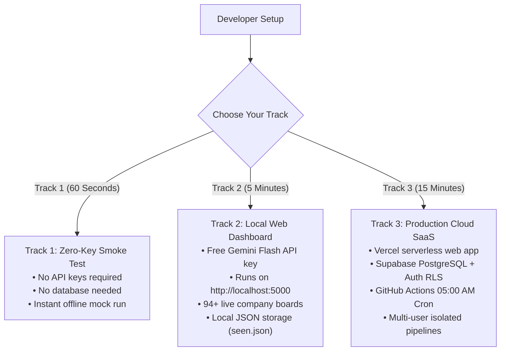
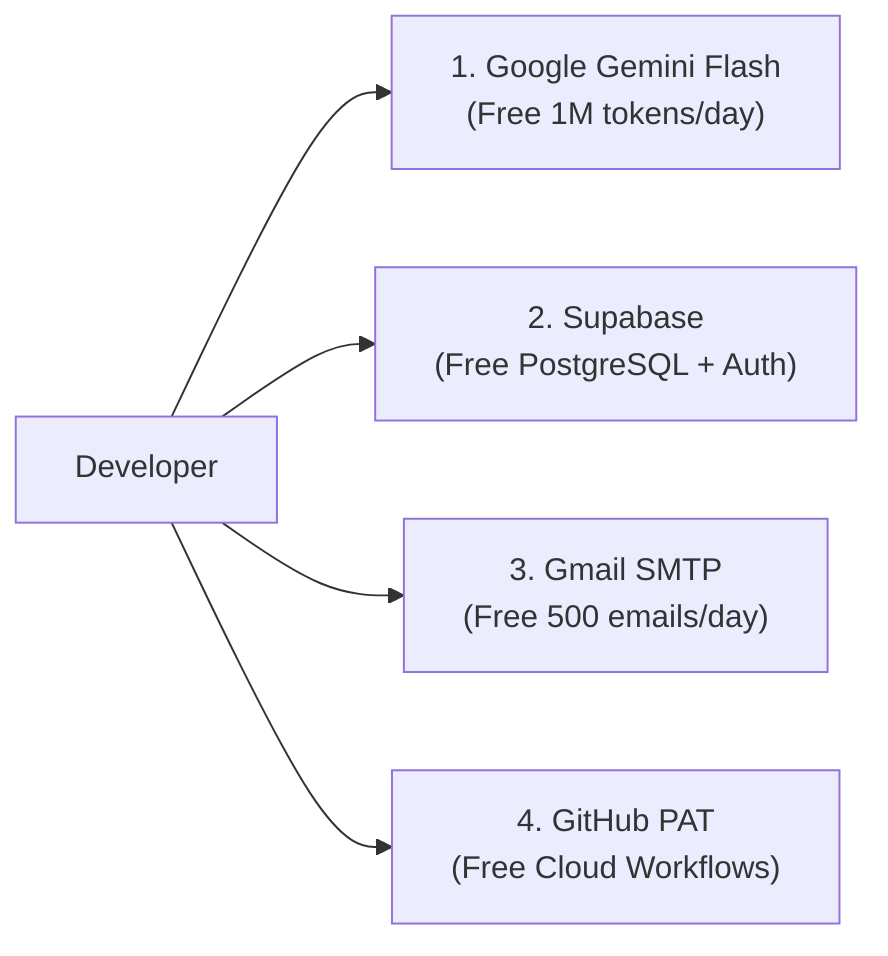
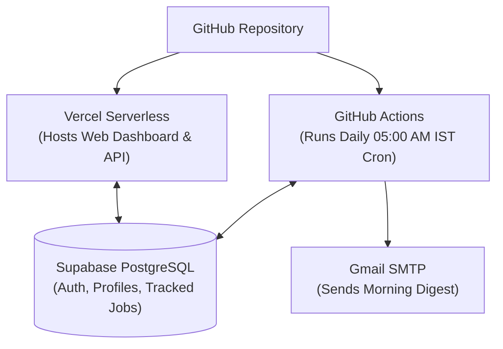

<p align="center">
  
</p>

# Job Hunter — Complete Developer Setup & Deployment Manual

Welcome to the definitive, step-by-step developer setup manual for **Job Hunter**. This guide is designed so that **any developer—from student engineers to senior DevOps architects—can configure, run, test, and deploy Job Hunter from scratch**.

Whether you want a **100% private, zero-database local utility** running in 60 seconds on your laptop, or a **full-fledged, multi-tenant cloud SaaS deployment** running 24/7 on Vercel, Supabase, and GitHub Actions, every single step, click path, credential, and command is documented below.

---

## 🧭 Setup Pathways: Choose Your Track

Job Hunter's modular architecture supports three distinct operating models:



| Feature | Track 1: Smoke Test | Track 2: Local Web | Track 3: Cloud SaaS |
|---|:---:|:---:|:---:|
| **Setup Time** | < 60 seconds | ~5 minutes | ~15 minutes |
| **API Keys Needed** | None | 1 (Google Gemini) | Gemini, Supabase, GitHub |
| **Database** | None | Local file (`seen.json`) | Supabase PostgreSQL |
| **Interface** | CLI / HTML File | Browser (`localhost:5000`) | Web App (`your-app.vercel.app`) |
| **Automated Crawl** | Manual | Windows Task / Cron | GitHub Actions (Daily 05:00 AM) |
| **Cost** | **$0.00** | **$0.00** | **$0.00** (Free Tier Stack) |

---

## Table of Contents

1. [Prerequisites & System Requirements](#1-prerequisites--system-requirements)
2. [Phase 1: Local Environment Preparation](#2-phase-1-local-environment-preparation)
   - [Step 1.1: Install Python 3.9 – 3.12](#step-11-install-python-39--312)
   - [Step 1.2: Clone the Repository](#step-12-clone-the-repository)
   - [Step 1.3: Create & Activate Virtual Environment](#step-13-create--activate-virtual-environment)
   - [Step 1.4: Install Dependencies](#step-14-install-dependencies)
   - [Step 1.5: 60-Second Zero-Key Smoke Test (Track 1)](#step-15-60-second-zero-key-smoke-test-track-1)
3. [Phase 2: External Services & API Keys (100% Free)](#3-phase-2-external-services--api-keys-100-free)
   - [Step 2.1: Google Gemini Flash API Key (Primary AI Engine)](#step-21-google-gemini-flash-api-key-primary-ai-engine)
   - [Step 2.2: Supabase PostgreSQL & Auth (For Track 3 & Multi-User)](#step-22-supabase-postgresql--auth-for-track-3--multi-user)
   - [Step 2.3: Gmail SMTP App Password (Daily Morning Briefings)](#step-23-gmail-smtp-app-password-daily-morning-briefings)
   - [Step 2.4: GitHub Personal Access Token (Cloud Radar Dispatch)](#step-24-github-personal-access-token-cloud-radar-dispatch)
4. [Phase 3: Environment Configuration (`.env`)](#4-phase-3-environment-configuration-env)
   - [Step 3.1: Create & Populate `.env`](#step-31-create--populate-env)
   - [Step 3.2: Complete `.env` Reference Table](#step-32-complete-env-reference-table)
5. [Phase 4: Candidate Profile & Target Board Customization](#5-phase-4-candidate-profile--target-board-customization)
   - [Step 4.1: Extract Candidate Profile from Resume (`profile.json`)](#step-41-extract-candidate-profile-from-resume-profilejson)
   - [Step 4.2: Tune Filter Rules & Indian Tech Hubs (`config.yaml`)](#step-42-tune-filter-rules--indian-tech-hubs-configyaml)
   - [Step 4.3: Add or Customize Target Company Boards (`companies.yaml`)](#step-43-add-or-customize-target-company-boards-companiesyaml)
6. [Phase 5: Running Locally (Track 2)](#6-phase-5-running-locally-track-2)
   - [Step 5.1: Launch the Local Web Dashboard](#step-51-launch-the-local-web-dashboard)
   - [Step 5.2: Execute the Automation Pipeline via CLI](#step-52-execute-the-automation-pipeline-via-cli)
   - [Step 5.3: CLI Power-User Command Reference](#step-53-cli-power-user-command-reference)
7. [Phase 6: Cloud Production Deployment (Track 3)](#7-phase-6-cloud-production-deployment-track-3)
   - [Step 6.1: Deploy Serverless Web App to Vercel](#step-61-deploy-serverless-web-app-to-vercel)
   - [Step 6.2: Configure Automated Daily 05:00 AM Cron via GitHub Actions](#step-62-configure-automated-daily-0500-am-cron-via-github-actions)
   - [Step 6.3: (Alternative) Native Windows Daily Task Scheduler](#step-63-alternative-native-windows-daily-task-scheduler)
8. [Phase 7: End-to-End Verification Matrix](#8-phase-7-end-to-end-verification-matrix)
9. [Phase 8: Developer Troubleshooting & FAQ](#9-phase-8-developer-troubleshooting--faq)

---

## 1. Prerequisites & System Requirements

Before you begin, verify your machine meets the minimum requirements:

* **Operating System**:
  - Windows 10/11 (PowerShell or Command Prompt)
  - macOS (Intel or Apple Silicon M1/M2/M3)
  - Linux (Ubuntu, Debian, Fedora, Arch, CentOS)
* **Python Runtime**: **Python 3.9, 3.10, 3.11, or 3.12** installed and accessible in your system `PATH`. (Python 3.10 or 3.11 recommended).
* **Git**: Installed for cloning the repository.
* **Hardware Requirements**:
  - CPU: Any modern 64-bit dual-core processor.
  - RAM: 512 MB minimum (lightweight memory footprint).
  - Disk: < 100 MB for source code and dependencies.

---

## 2. Phase 1: Local Environment Preparation

### Step 1.1: Install Python 3.9 – 3.12

Check if Python is already installed on your system:

```bash
# Windows
python --version

# macOS / Linux
python3 --version
```

If Python is not installed or version is `< 3.9`:
* **Windows**: Download from [python.org/downloads](https://www.python.org/downloads/).
  > [!IMPORTANT]
  > On the very first installer window, **check "Add python.exe to PATH"** before clicking Install Now.
* **macOS**: Run `brew install python@3.11` using Homebrew, or download from python.org.
* **Linux (Ubuntu/Debian)**:
  ```bash
  sudo apt update
  sudo apt install -y python3 python3-venv python3-pip git
  ```

---

### Step 1.2: Clone the Repository

Clone the project repository to your local machine:

```bash
git clone https://github.com/tanish-jain-225/job-hunter.git
cd job-hunter
```

---

### Step 1.3: Create & Activate Virtual Environment

Always use an isolated virtual environment to avoid dependency conflicts:

#### On Windows (PowerShell):
```powershell
python -m venv .venv
.\.venv\Scripts\Activate.ps1
```

> [!TIP]
> **PowerShell ExecutionPolicy Error?**
> If PowerShell displays `PSSecurityException: File ... cannot be loaded because running scripts is disabled on this system`, run this once in your PowerShell window and re-activate:
> ```powershell
> Set-ExecutionPolicy -Scope Process -ExecutionPolicy Bypass
> ```

#### On Windows (Command Prompt - `cmd.exe`):
```cmd
python -m venv .venv
.\.venv\Scripts\activate.bat
```

#### On macOS & Linux (`bash` / `zsh`):
```bash
python3 -m venv .venv
source .venv/bin/activate
```

Your terminal prompt will now display `(.venv)` indicating the virtual environment is active.

---

### Step 1.4: Install Dependencies

Upgrade `pip` and install the package in editable development mode (`-e .`):

```bash
# Upgrade pip to latest version
python -m pip install --upgrade pip

# Install job-hunter in editable mode
pip install -e .

# Optional: Install test and lint dependencies
pip install pytest pytest-asyncio pytest-cov ruff mypy
```

Verify the `jobhunt` CLI command is globally accessible within your virtual environment:

```bash
jobhunt --help
```

---

### Step 1.5: 60-Second Zero-Key Smoke Test (Track 1)

Before setting up any external API keys or databases, run the built-in offline smoke test. This proves that the CLI, ATS parsers, regex prefilters, and HTML briefing compiler work on your machine:

```bash
jobhunt run --mock --scorer keyword
```

**Expected Console Output:**
```text
[1/5] fetching boards (mock fixtures)
[2/5] filtering
  prefilter: 12 -> 5 (dropped title=5 location=1 stale=1)
[3/5] screening 5 jobs (keyword stub — DEV ONLY)
  3 scored >= 7.0
[4/5] drafting kits for 3
[5/5] digest
  wrote out/digest.html

funnel: 12 scanned -> 5 passed filters -> 5 new -> 3 in digest
```

Job Hunter will generate `out/digest.html` and automatically open the visual career briefing in your default browser. **Track 1 is now fully operational!**

---

## 3. Phase 2: External Services & API Keys (100% Free)

All services used by Job Hunter offer generous free tiers. You do not need to pay anything to run Job Hunter indefinitely.



---

### Step 2.1: Google Gemini Flash API Key (Primary AI Engine)

Job Hunter uses **Google Gemini 3.5 Flash (`gemini-3.5-flash`)** for candidate match scoring, application kit drafting, and PDF resume extraction.

1. Open **[Google AI Studio](https://aistudio.google.com/app/apikey)** in your browser.
2. Sign in with your Google account.
3. Click **"Create API Key"** $\rightarrow$ **"Create API key in new project"**.
4. Copy the generated key (starts with `AIzaSy...`).
5. *(Scale / High-Throughput Tip)*: You can generate multiple free keys across separate Google projects and supply them as a comma-separated list:
   `GEMINI_API_KEY=key1,key2,key3`
   Job Hunter will automatically alternate requests round-robin to maximize free quota!

---

### Step 2.2: Supabase PostgreSQL & Auth (For Track 3 & Multi-User)

> *If you only want to use Job Hunter locally with local file storage (`seen.json`), you can skip this step and set `AUTH_REQUIRED=false`.*

1. Create a free account at **[supabase.com](https://supabase.com)** and click **"New Project"** (e.g. `job-hunter`).
2. Choose a database password and select your preferred region (e.g., `Central India (Mumbai)` or `East US`).
3. Once provisioned (~60 seconds), navigate to the **SQL Editor** in the left sidebar.
4. Click **"New Query"**, open [`supabase/schema.sql`](../supabase/schema.sql) from this repository, copy its entire contents, paste it into the editor, and click **Run**.
   * *This creates the 3 multi-tenant tables (`user_profiles`, `user_tracked_jobs`, `user_pipeline_runs`), triggers, indexes, and enables PostgreSQL Row-Level Security (RLS).*
5. Go to **Project Settings** (gear icon) $\rightarrow$ **API**:
   - Copy **Project URL** $\rightarrow$ `SUPABASE_URL` (e.g. `https://xyzproject.supabase.co`)
   - Copy **Project API Keys** $\rightarrow$ `anon` `public` $\rightarrow$ `SUPABASE_ANON_KEY`
   - Copy **Project API Keys** $\rightarrow$ `service_role` `secret` $\rightarrow$ `SUPABASE_SERVICE_ROLE_KEY`
6. Under **JWT Settings** (same API settings page):
   - Copy **Legacy JWT Secret** $\rightarrow$ `SUPABASE_JWT_SECRET` *(Allows serverless endpoints on Vercel to verify tokens in microseconds without external HTTP roundtrips)*.
7. Go to **Authentication** $\rightarrow$ **URL Configuration**:
   - Set **Site URL** to:
     - For local development: `http://localhost:5000`
     - For production: `https://your-project.vercel.app`
   - Under **Redirect URLs**, add both `http://localhost:5000` and `https://your-project.vercel.app`.

> [!NOTE]
> To reset your database tables at any time, execute [`supabase/teardown.sql`](../supabase/teardown.sql) in the SQL Editor.

---

### Step 2.3: Gmail SMTP App Password (Daily Morning Briefings)

Job Hunter dispatches your personalized HTML career briefing via SMTP directly to your inbox every morning.

1. Open your **[Google Account Security](https://myaccount.google.com/security)** page.
2. Ensure **2-Step Verification** is turned **ON**.
3. Go directly to **[Google App Passwords](https://myaccount.google.com/apppasswords)**.
4. In the "App name" box, type `Job Hunter` and click **Create**.
5. Copy the generated **16-character password** (e.g. `abcd efgh ijkl mnop`).
   > [!WARNING]
   > Never use your primary personal Gmail login password. Google blocks direct SMTP access with regular account passwords.

---

### Step 2.4: GitHub Personal Access Token (Cloud Radar Dispatch)

This allows the **"Run Job Hunt Now"** button on the web dashboard to trigger a live cloud crawl via GitHub Actions:

1. Open **[GitHub Personal Access Tokens (Classic)](https://github.com/settings/tokens/new)**.
2. Token Note: `Job Hunter Cloud Dispatch`.
3. Expiration: Choose 90 days or No expiration.
4. Select Scopes:
   - Check **`workflow`** (Required to trigger `.github/workflows/daily.yml`).
   - If your repository is private, also check **`repo`**.
5. Click **Generate token** and copy it $\rightarrow$ `GH_TOKEN`.

---

## 4. Phase 3: Environment Configuration (`.env`)

### Step 3.1: Create & Populate `.env`

In your project root directory, copy `.env.example` to create `.env`:

```bash
# Windows (PowerShell)
Copy-Item .env.example .env

# macOS / Linux
cp .env.example .env
```

Open `.env` in your text editor (VS Code, Cursor, Notepad, etc.) and fill in your credentials:

```ini
# ==============================================================================
# Job Hunter Configuration
# ==============================================================================

# 1. AI Intelligence Engine (Google Gemini Flash)
# Get key: https://aistudio.google.com/app/apikey
# Supports comma-separated keys for automatic round-robin: key1,key2
GEMINI_API_KEY=AIzaSyYourGeminiApiKeyHere

# 2. Outbound Email Delivery (Gmail SMTP App Password)
# Get app password: https://myaccount.google.com/apppasswords
SMTP_HOST=smtp.gmail.com
SMTP_PORT=587
SMTP_USER=your-email@gmail.com
SMTP_PASS=abcdefghijklmnop
MAIL_TO=your-email@gmail.com

# 3. Supabase PostgreSQL & Auth (Set AUTH_REQUIRED=false for local-only single user)
# Get credentials: https://supabase.com/dashboard/project/_/settings/api
SUPABASE_URL=https://your-project-id.supabase.co
SUPABASE_ANON_KEY=your-supabase-anon-key
SUPABASE_SERVICE_ROLE_KEY=your-supabase-service-role-key
SUPABASE_JWT_SECRET=your-supabase-legacy-jwt-secret
AUTH_REQUIRED=false

# 4. GitHub Actions Workflow Dispatch (For cloud on-demand radar from web UI)
# Get token: https://github.com/settings/tokens/new (scope: workflow)
GH_TOKEN=github_pat_your_token_here
GITHUB_REPOSITORY=your-github-username/job-hunter

# 5. Session Security
# Generate key via: python -c "import secrets; print(secrets.token_hex(32))"
FLASK_SECRET_KEY=generate_any_random_32_character_string_here
```

---

### Step 3.2: Complete `.env` Reference Table

| Variable | Required In | Description | Example / Default |
|---|:---:|---|---|
| `GEMINI_API_KEY` | All Modes | Google Gemini API key(s) for screening & kits. | `AIzaSy...` or `key1,key2` |
| `AUTH_REQUIRED` | Cloud / Multi-User | Set `true` to require Supabase login; `false` for local mode. | `false` (Local) / `true` (Cloud) |
| `SUPABASE_URL` | Track 3 | URL of your Supabase project. | `https://xyz.supabase.co` |
| `SUPABASE_ANON_KEY` | Track 3 | Public anonymous key for client frontend. | `eyJhbGciOi...` |
| `SUPABASE_SERVICE_ROLE_KEY` | Track 3 | Secret admin key for backend data persistence. | `eyJhbGciOi...` |
| `SUPABASE_JWT_SECRET` | Track 3 | Legacy JWT secret for fast HMAC token validation. | String from Supabase API settings |
| `SMTP_HOST` | Email Alerts | Outbound SMTP server hostname. | `smtp.gmail.com` |
| `SMTP_PORT` | Email Alerts | SMTP port (STARTTLS). | `587` |
| `SMTP_USER` | Email Alerts | Email account username. | `user@gmail.com` |
| `SMTP_PASS` | Email Alerts | 16-character Gmail App Password. | `abcd efgh ijkl mnop` |
| `MAIL_TO` | Email Alerts | Target inbox for local/single-user daily digests. | `user@gmail.com` |
| `GH_TOKEN` | Cloud Radar | GitHub PAT for dispatching workflow runs. | `github_pat_...` |
| `GITHUB_REPOSITORY` | Cloud Radar | Your GitHub repository path `owner/repo`. | `octocat/job-hunter` |
| `FLASK_SECRET_KEY` | All Modes | Secret string used to sign session cookies. | 32-character hex string |
| `LLM_PROVIDER` | Optional | Primary AI provider override (`gemini`, `anthropic`, `groq`). | `gemini` |

---

## 5. Phase 4: Candidate Profile & Target Board Customization

### Step 4.1: Extract Candidate Profile from Resume (`profile.json`)

You can generate your candidate profile automatically from an existing resume file (`.pdf`, `.txt`, or `.md`):

```bash
# Place your resume in the project root as resume.pdf, then run:
jobhunt profile --resume resume.pdf
```

The AI engine extracts your candidate name, current title, years of experience, education, target titles, and core skills, writing them to `profile.json`.

You can also customize [`profile.example.json`](../profile.example.json) directly. Here is a sample showing both Indian recruitment fields and global parameters:

```json
{
  "name": "Arjun Sharma",
  "location": "Bengaluru, India / Remote",
  "email": "arjun.sharma@example.com",
  "current_title": "Full Stack & AI Software Engineer",
  "years_experience": 2,
  "education": "B.Tech in Computer Engineering | CGPA: 8.7 / 10",
  "notice_period": "30_days",
  "current_ctc_lpa": 14,
  "expected_ctc_lpa": 22,
  "location_preference": "all_india",
  "preferred_locations": ["Bengaluru", "Hyderabad", "Pune", "Delhi-NCR", "Remote"],
  "core_skills": [
    "Python", "JavaScript", "TypeScript", "React", "Node.js", 
    "FastAPI", "PostgreSQL", "Docker", "Git", "Gemini API"
  ],
  "target_titles": [
    "Software Engineer", "Full Stack Engineer", "Backend Developer", "SDE II"
  ],
  "job_types": ["fulltime", "remote"]
}
```

---

### Step 4.2: Tune Filter Rules & Indian Tech Hubs (`config.yaml`)

[`config.yaml`](../config.yaml) governs the deterministic $0 regex prefilter that eliminates noise before LLM scoring:

```yaml
filters:
  # Included job titles (accepts regex). Leave empty to match all tech titles.
  include_titles:
    - 'software engineer'
    - 'backend'
    - 'full.?stack'
    - 'sde'
    - 'ai engineer'

  # Excluded titles (C-suite, non-tech, sales, recruitment)
  exclude_titles:
    - '\b(ceo|coo|cfo|cto|ciso|vp|svp|evp|c-suite)\b'
    - '\b(sales|marketing|recruiter|talent.*acquisition)\b'

  # Location filter: Use "all_india" to automatically target all major Indian tech hubs,
  # or list specific cities like ["bengaluru", "pune", "remote"].
  locations:
    - "all_india"
  allow_remote: true
  max_age_days: 21

# Scoring & Batching Options
screen_batch_size: 8      # Evaluates 8 jobs per LLM request (optimal for Gemini Flash)
score_threshold: 7.0      # Minimum fit score (0.0 - 10.0) required to draft an Application Kit
max_per_digest: 7         # Maximum top roles included in the morning email briefing
```

---

### Step 4.3: Add or Customize Target Company Boards (`companies.yaml`)

[`companies.yaml`](../companies.yaml) defines the target career portals scouted by Job Hunter. It comes pre-configured with **94 verified live company boards** across India and globally:

```yaml
companies:
  # Indian Tech Unicorns & Product Companies (Lever & Greenhouse)
  - {ats: lever, slug: swiggy, name: Swiggy}
  - {ats: lever, slug: meesho, name: Meesho}
  - {ats: lever, slug: paytm, name: Paytm}
  - {ats: lever, slug: atlan, name: Atlan}
  - {ats: greenhouse, slug: razorpay, name: Razorpay}
  - {ats: greenhouse, slug: zepto, name: Zepto}
  - {ats: greenhouse, slug: cars24, name: Cars24}

  # Global Tech & GCC Centers (Ashby, Workable, SmartRecruiters, BambooHR)
  - {ats: ashby, slug: openai, name: OpenAI}
  - {ats: ashby, slug: ramp, name: Ramp}
  - {ats: greenhouse, slug: stripe, name: Stripe}
  - {ats: lever, slug: grab, name: Grab}
  - {ats: smartrecruiters, slug: bosch-group-in, name: Bosch India}
```

> [!TIP]
> **Verify Live Reachability**: Run `jobhunt verify` anytime to test HTTP 200 connectivity across all 94 career boards in parallel.

---

## 6. Phase 5: Running Locally (Track 2)

### Step 5.1: Launch the Local Web Dashboard

Start the local Flask development server:

```bash
python app.py
```

Open your browser and navigate to:
👉 **`http://localhost:5000`**

#### Key Dashboard Capabilities:
* **Interactive Job Board**: View evaluated roles with color-coded match scores (`8.5+ High Fit`, `7.0-8.4 Moderate`).
* **Location Quick-Filter**: Filter by `All Locations`, `🇮🇳 India-Based`, or `🌐 Remote-Friendly`.
* **Application Kit Inspector**: Click **Inspect Kit** on any job to view its tailored cover letter, cold outreach DM, and **LinkedIn Referral Request note** with 1-click clipboard copy.
* **Resume Studio**: Drag-and-drop your resume to update skills and criteria with AI.
* **Add Custom Board**: Click **+ Add Board** in the toolbar, paste any career URL, and Job Hunter auto-detects the ATS and slug!

---

### Step 5.2: Execute the Automation Pipeline via CLI

Run the full end-to-end automation in a single terminal command:

```bash
python auto.py
```

To run the crawl, score candidates with Gemini, draft application kits, and dispatch your morning email briefing in one step:

```bash
python auto.py --send
```

---

### Step 5.3: CLI Power-User Command Reference

| Command | What It Does | Common Flags |
|---|---|---|
| `jobhunt run` | Executes scouting, filtering, AI scoring, and kit drafting. | `--mock`, `--send`, `--scorer keyword` |
| `jobhunt profile` | Extracts candidate profile from resume file. | `--resume path/to/resume.pdf` |
| `jobhunt verify` | Verifies live HTTP 200 reachability of all company boards. | `--workers 10`, `--ats greenhouse` |
| `jobhunt applied <id>` | Marks a role as applied and activates follow-up tracking. | `jobhunt applied greenhouse:stripe:123` |
| `jobhunt stats` | Displays pipeline statistics and updates `out/tracker.csv`. | None |
| `jobhunt clean` | Cleans temporary cache files, test outputs, and state. | None |
| `jobhunt multi-run` | Runs batch crawl across all registered Supabase users. | `--send`, `--user-email user@test.com` |

---

## 7. Phase 6: Cloud Production Deployment (Track 3)

Deploy Job Hunter to the cloud so it runs 24/7 autonomously:



---

### Step 6.1: Deploy Serverless Web App to Vercel

1. Push your repository to GitHub:
   ```bash
   git add .
   git commit -m "Configure Job Hunter for production"
   git push origin main
   ```
2. Log in to **[vercel.com](https://vercel.com)**.
3. Click **"Add New"** $\rightarrow$ **"Project"** $\rightarrow$ Import your `job-hunter` repository.
4. Framework Preset: Leave as **Other** (Vercel automatically detects `vercel.json` and `@vercel/python`).
5. Expand **Environment Variables** and add:
   * `GEMINI_API_KEY`: Your Google Gemini API key
   * `SUPABASE_URL`: `https://your-project.supabase.co`
   * `SUPABASE_ANON_KEY`: Your Supabase anon public key
   * `SUPABASE_SERVICE_ROLE_KEY`: Your Supabase service role secret key
   * `SUPABASE_JWT_SECRET`: Your Supabase legacy JWT secret
   * `AUTH_REQUIRED`: `true`
   * `FLASK_SECRET_KEY`: Random 32-character string
   * `GH_TOKEN`: GitHub Personal Access Token (for on-demand radar triggers)
   * `GITHUB_REPOSITORY`: `your-github-username/job-hunter`
6. Click **Deploy**. Vercel will build and launch your web app at `https://your-project.vercel.app`!

---

### Step 6.2: Configure Automated Daily 05:00 AM Cron via GitHub Actions

The repository includes a ready-to-use GitHub Actions workflow in [`.github/workflows/daily.yml`](../.github/workflows/daily.yml).

1. In your GitHub repository, open **Settings** $\rightarrow$ **Secrets and variables** $\rightarrow$ **Actions**.
2. Click **"New repository secret"** and add:
   - `GEMINI_API_KEY`
   - `SUPABASE_URL`
   - `SUPABASE_ANON_KEY`
   - `SUPABASE_SERVICE_ROLE_KEY`
   - `SMTP_USER`
   - `SMTP_PASS`
   - `MAIL_TO` (Required for single-user mode)
3. Navigate to the **Actions** tab in GitHub:
   - Click **"Daily Career Intelligence Digest"** in the left sidebar.
   - Click **"Run workflow"** to trigger a test execution immediately!
   - By default, the workflow executes automatically every day at **05:00 AM IST (23:30 UTC)**.

---

### Step 6.3: (Alternative) Native Windows Daily Task Scheduler

If you prefer to run automated daily crawls locally on your Windows machine:

1. Open PowerShell or Command Prompt as **Administrator**.
2. Execute the included setup batch script:
   ```cmd
   scripts\setup_daily_task.bat
   ```
3. Windows Task Scheduler registers `JobHunterDailyDigest` to automatically run `python auto.py --send` every morning at 05:00 AM in the background!

---

## 8. Phase 7: End-to-End Verification Matrix

Run this diagnostic checklist to verify every subsystem:

| Subsystem | Command | Expected Output | Status |
|---|---|---|:---:|
| **1. Mock Smoke Test** | `jobhunt run --mock --scorer keyword` | Scans mock jobs, writes `out/digest.html` | ✅ Passed |
| **2. Board Reachability** | `jobhunt verify --workers 10` | 94/94 boards verified reachable (HTTP 200) | ✅ Passed |
| **3. Automated Test Suite** | `python -m pytest tests/` | **429 passed tests** in ~55s | ✅ Passed |
| **4. Web Health Endpoint** | Start `python app.py`, then `curl http://localhost:5000/api/health` | `{"status": "healthy", "service": "job-hunter"}` | ✅ Passed |
| **5. Type Checking** | `mypy jobhunt` | Success: no issues found | ✅ Passed |
| **6. Code Linting** | `ruff check .` | All checks passed (0 errors) | ✅ Passed |

---

## 9. Phase 8: Developer Troubleshooting & FAQ

#### Q: PowerShell says `cannot be loaded because running scripts is disabled`.
**Fix**: Execute `Set-ExecutionPolicy -Scope Process -ExecutionPolicy Bypass` in your terminal window and re-run `.venv\Scripts\Activate.ps1`.

#### Q: Port 5000 is already in use (`Address already in use`).
* **On macOS**: macOS Monterey/Ventura uses port 5000 for AirPlay Receiver. Go to **System Settings** $\rightarrow$ **General** $\rightarrow$ **AirDrop & Handoff** and turn off **AirPlay Receiver**, or run Job Hunter on another port:
  ```bash
  python -c "from jobhunt.web import create_app; create_app().run(port=5001)"
  ```
* **On Windows**: Check what process is occupying port 5000 via `netstat -ano | findstr :5000` and terminate it, or launch on port 5001.

#### Q: Supabase returns `401 Unauthorized` or `403 Forbidden` on profile API calls.
**Fix**: Verify that you executed [`supabase/schema.sql`](../supabase/schema.sql) in your Supabase SQL Editor. The schema configures Row-Level Security (RLS) policies allowing `authenticated` users to select/insert/update their own rows. Also verify that `SUPABASE_SERVICE_ROLE_KEY` is set in your `.env`.

#### Q: Google Gemini throws `HTTP 429: Resource Exhausted`.
**Fix**: Provide multiple free Gemini keys in your `.env` separated by commas:
`GEMINI_API_KEY=key1,key2,key3`
Job Hunter automatically alternates keys round-robin and cascades to fallback models (`gemini-flash-latest` $\rightarrow$ `gemini-flash-lite-latest`) with automatic cooldown tracking.

#### Q: Gmail SMTP fails with `535 5.7.8 Username and Password not accepted`.
**Fix**: You cannot use your standard Google account password. You must turn on 2-Step Verification and generate a 16-character **App Password** from [myaccount.google.com/apppasswords](https://myaccount.google.com/apppasswords).

#### Q: How do I add custom company boards that use custom subdomains?
**Fix**: Click **+ Add Board** in the web dashboard and paste the careers page URL. Job Hunter's regex detector recognizes Greenhouse, Lever, Ashby, Workable, SmartRecruiters, BambooHR, Recruitee, Breezy HR, and Pinpoint, automatically registering the slug in your profile.

---

## Related Documentation

- **[GUIDE.md](GUIDE.md)** — Complete candidate user manual, feature tour, and job search playbook.
- **[ARCHITECTURE.md](ARCHITECTURE.md)** — In-depth architectural designs, state machines, and data flow.
- **[DASHBOARD.md](DASHBOARD.md)** — Web dashboard features and REST API documentation.
- **[ENGINE.md](ENGINE.md)** — Technical details on regex prefiltering and Gemini scoring.
- **[MULTI_USER.md](MULTI_USER.md)** — Multi-tenant batch execution and RLS data governance.
- **[TROUBLESHOOTING.md](TROUBLESHOOTING.md)** — Diagnostic workflows and common solutions.
- **[README.md](../README.md)** — Project homepage.
